# Network analysis with Gephi

Today, network analysis is being used to study a wide variety of subjects, from how networks of genes and proteins influence our health to how connections between multinational companies affect the stability of the global economy. Network graphs can also be used to great effect in journalism to explore and illustrate connections that are crucial to public policy, or directly affect the lives of ordinary people.

Do any of these phrases have resonance for you?

- The problem with this city is that it’s run by X’s cronies.

- Contracts in this town are all about kickbacks.

- Follow the money!

- It's not what you know, it's who you know.

If so, and you can gather relevant data, network graphs can provide a means to display the connections involved in a way that your audience (and your editors) can readily understand.

### The data we will use

Download the data from this session from [here](data/gephi.zip), unzip the folder and place it on your desktop. It contains the following folders and files:

- `friends.csv` A simple network documenting relationships among a small group of people.
- `senate_113-2013.gexf` `senate-113-2014.gexf` Two files with data on voting patterns in the U.S. Senate, detailing the number and percentage of times pairs of Senators voted the same way in each year.
- `senate_one_session.py` Python script that will scrape a single year's data from [GovTrack.US](http://govtrack.us/); modified from a [script](https://gist.github.com/rlucioni/8bdb1092579041ce739c) written by [Renzo Lucioni](http://www.renzolucioni.com/).
- `senate` Folder containing files and code to make an interactive version of the Senate voting network.

### Network analysis: the basics

At its simplest level, network analysis is very straightforward. Network graphs consist of edges (the connections) and nodes (the entities that are connected).

One important consideration is whether the network is "directed," "undirected," or a mixture of the two. This depends upon the nature of the connections involved. If you are documenting whether people are Facebook friends, for instance, and have no information who made the original friend request, the connections have no obvious direction. But when considering following relationships on Twitter, there is a clear directionality to each relationship: A fan might follow Taylor Swift, for example, but she probably doesn't follow them back.

The connections in undirected graphs are typically represented by simple lines or curves, while directed relationships are usually represented by arrows.

Here, for example, I used a directed network graph to illustrate patterns of citation of one another's work by researchers working on a type of stem cell that later won their discoverer a Nobel prize. Notice that in some cases there are arrows going in both connections, because each had frequently cited the other:

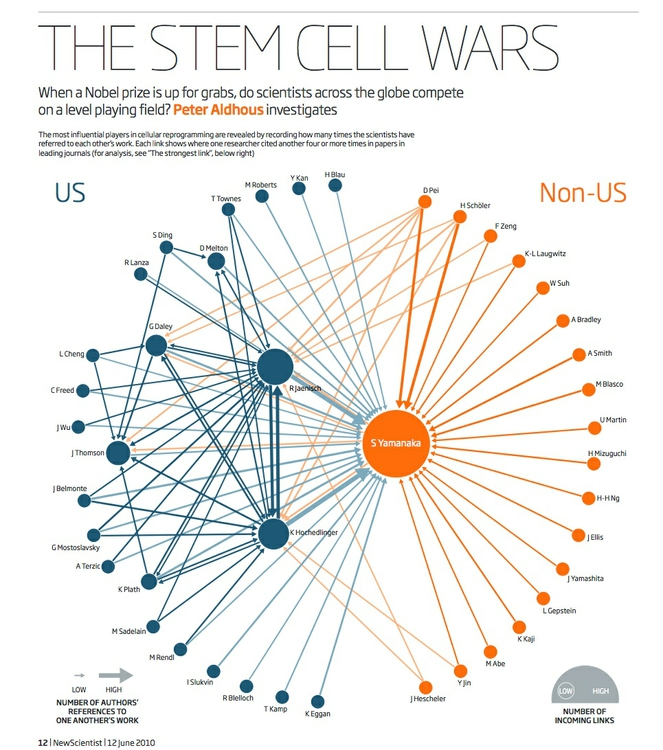

(Source: *[New Scientist](http://peteraldhous.com/Articles/The_stem_cell_wars.pdf)*)

Nodes and edges can each have data associated with them, which can be represented using size, color and shape.

### Network algorithms and metrics

Networks can be drawn manually,  with the nodes placed individually to give the most informative display. However, network theorists have devised layout algorithms to automate the production of network graphs. These can be very useful, especially when visualizing large and complex networks.

There are also a series of metrics that can quantify aspects of a network. Here are some examples, which measure the importance of nodes within a network in slightly different ways:

- **[Degree](http://en.wikipedia.org/wiki/Centrality#Degree_centrality)** is a simple count of the number of connections for each node. For directed networks, it is divided into In-degree, for the number of incoming connections, and Out-degree, for outgoing connections. (In my stem cell citation network, In-Degree was used to set the size of each node.)
- **[Eigenvector centrality](http://en.wikipedia.org/wiki/Centrality#Eigenvector_centrality)** accounts not only for the node’s own degree, but also the degrees of the nodes to which it connects. As such, it is a measure of each node's wider "influence" within the network. Google's [PageRank](http://en.wikipedia.org/wiki/PageRank) algorithm, which rates the importance of web pages according the the links they recieve, is a variant of this measure.
- **[betweenness centrality](http://en.wikipedia.org/wiki/Centrality#Betweenness_centrality)** essentially reveals how important each node is in providing a “bridge” between different parts of the network: It counts the number of times each node appears on the shortest path between two other nodes. It is particularly useful for highlighting the nodes that, if removed, would cause a network to fall apart.
- **[Closeness centrality](http://en.wikipedia.org/wiki/Centrality#Closeness_centrality)** is a measure of how close each node is, on average, to all of the other nodes in a network. It highlights the nodes that connect to the others through a lower number of edges. The [Kevin Bacon Game](http://www.thekevinbacongame.com/), in which you have to connect Bacon to other movie actors through the fewest number of movies, based on co-appearances, works because he has a high closeness centrality in this network.

### Network data formats

The most basic data needed to draw a network is an "edge list" -- a list of pairs of nodes that connect within the network, which can be created in a spreadsheet with two columns, one for each member of each pair of nodes.

There are also a number of dedicated data formats used to record data about networks, which can store a variety of data about both edges and nodes. Here are two of the most common:

**[GEXF](http://gexf.net/format/)** is a variant of XML, and is the native data format for Gephi, the network visualization software we will use today.

**[GraphML](http://graphml.graphdrawing.org//)** is another, older XML format used for storing and exchanging network graph data.

For visualizing networks online, it often makes sense to save them as **[JSON](http://json.org/)**, which keeps file size small and works well with JavaScript visualization libraries.

### Introducing Gephi

[Gephi](http://gephi.github.io/) is a tool designed to draw, analyze, filter and customize the appearance of network graphs according to qualitative and quantitative variables in the data.

Gephi allows you to deploy layout algorithms, or to place nodes manually. It can calculate network metrics, and lets you use the results of these analyses to customize the appearance of your network graph.

Finally, Gephi allows you to create publication-quality vector graphics of your network visualizations, and to export your filtered and analyzed networks in data formats that can be displayed interactively online, using JavaScript visualization libraries.

Launch Gephi, and you will see a screen like this:

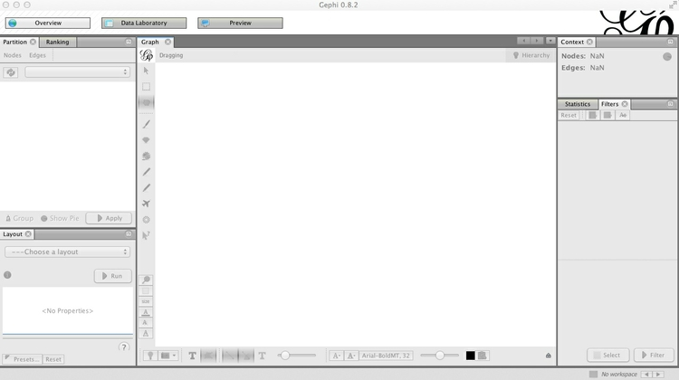

(You may also see an initial welcome window, allowing you to load recently used or sample data. You can close this.)

### Install Gephi plugins

Gephi has a series of plugins that extend its functionality -- you can browse the available options [here](https://marketplace.gephi.org/plugins/).

We will install a plugin that we will later use to export data from Gephi as JSON. Select `Tools>Plugins` from the top menu, and the Plugins window should open:


In the `Available Plugins` tab, look for the [JSONExporter](https://marketplace.gephi.org/plugin/json-exporter/) plugin -- you can use the `Search` box to find them, if necessary. Then click `Install`.

After installing plugins, you may be prompted to restart Gephi, which you should do.

If you do not find the plugin you are looking for, close Gephi and browse for the plugin at the [Gephi marketplace](https://marketplace.gephi.org/plugins/), where you can download manually. Then relaunch Gephi, select `Tools>Plugins` from the top menu and go to the `Downloaded` tab. Click the `Add Plugins ...` button, and navigate to where the plugin was saved on your computer -- it should be in a zipped folder or have an `.nbm` file extension. Then click `Install` and follow the instructions that appear.

See [here](https://marketplace.gephi.org/how-to-install-a-plugin/) for more instructions on installing Gephi plugins.

### Make a simple network graph illustrating connections between friends

Having launched Gephi, click on `Data Laboratory`. This is where you can view and edit raw network data. From the top menu, select  `File>New Project`, and the screen should look like this:


Notice that you can switch between viewing `Nodes` and `Edges`, and that there are buttons to `Add node` and `Add edge`, which allow you to construct simple networks by manual data entry. Instead, we will import a simple edge list, to show how Gephi will add the nodes and draw the network from this basic data.

To do this, click the `Import Spreadsheet` button -- which actually imports CSV files, rather than spreadsheets in `.xls` or `.xlsx` format. Your CSV file should at a minimum have two columns, headed `Source` and `Target`. By default, Gephi will create a directed network from an edge list, with arrows pointing from from Source to Target nodes. If some or all of your connections are undirected, include a third column called `Type` and fill the rows with `Undirected` or `Directed`, as appropriate.

At the dialog box shown below, navigate to the file `friends.csv`, and ensure that the data is going to be imported as an `Edges table`:

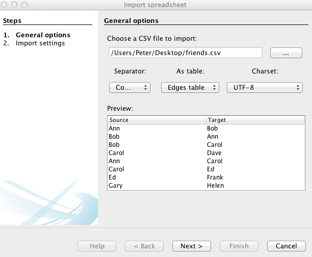

Click `Next>` and then `Finish`, and notice that Gephi has automatically created a `Nodes` table from the information in the `Edges` table:


In the `Nodes` table, click the `Copy data to other column` button at the bottom of the screen, select `Id` and click `OK` to copy to `Label`. This column can later be used to put labels on the network graph.

Now click `Add column`, call it `Gender` and keep its `Type` as `String`, because we are going to enter text values, rather than numbers. This column can later be used to color the friends according to their gender.

Having created the column, double-click on each row and enter `F` or `M`, as appropriate:


Now switch to the `Edges` table, and notice that each edge has been classed as `Directed`:

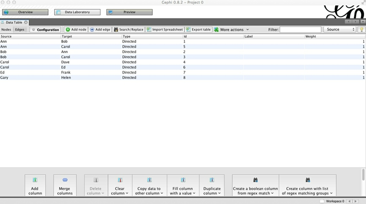

This would make sense if, for example, we were looking at dinner invitations made by the source nodes. Notice that in this network, not only has Ann invited Bob to dinner, but Bob has also invited Ann. For each of the other pairs, the invitations have not been reciprocated.

Now click `Overview` to go back to the main graph view, where a network graph should now be visible. You can use your mouse/trackpad to pan and zoom. On my trackpad, right-click and hold enables panning, while the double-finger swipe I would normally use to scroll enables zoom. Your settings may vary!

Note also that the left of the two sliders at bottom controls the size of the edges, and that individual nodes can be clicked and moved to position them manually. Below I have arranged the nodes so that none of the edges cross over one another. The `Context` panel at top right gives basic information about the network:


Click on the dark `T` button at bottom to call up labels for the nodes, and use the right of the two sliders to control their size. The light T button would call up edge labels, if they were set.

Turn off the labels once more, and we will next color the nodes according to the friends' gender.

Notice that the panel at top left contains two tabs, `Partition` and `Ranking`. The former is used to style nodes or edges according to qualitative variables, the latter styling by quantitative variables. Select `Partition>Nodes`, hit the `Refresh` button with the circling green arrows, select `Gender` and hit the `Run` button with the green "play" symbol. The nodes should now be colored by gender, and you may find that the edges also take the color of the source node:


To turn off this behavior, click this button at the bottom of the screen:  (the button to its immediate left allows edge visibility to be turned on and off).

Select `File>New Project` and you will be given the option to save your project before closing. You can also save your work at any time by selecting `File>Save` or by using the usual `⌘-S` or `Ctrl-S` shortcut.

### Visualize patterns of voting in the U.S. Senate

Having learned these basics, we will now explore a more interesting network, based on voting patterns in the U.S. Senate in 2014.

Select `File>Open` from the top menu and navigate to the file `senate-113-2014.gexf`. The next dialog box will give you some information about the network being imported, in this case telling you it it is an undirected network containing 101 nodes (two Senators left the chamber in 2013, their places filled first by temporary appointees, then elected replacements), and 5049 edges:

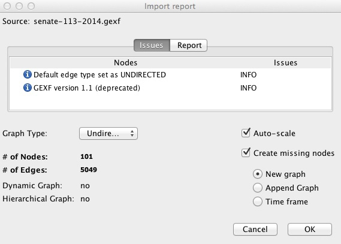

Once the network has imported, go to the `Data Laboratory` to view and examine the data for the `Nodes` and `Edges`. Notice that each edge has a column called `percent_agree`, which is the number of times the member of each pair of Senators voted the same way, divided by the total number of votes in the chamber in 2013, giving a number between 0 and 1:


Click the `Configuration` button, and ensure that `Visible graph only` is checked. When we start filtering the data, this will ensure that the data tables show the filtered network, not the original.

Now return to the `Overview`, where we will use a layout algorithm to alter the appearance of the network. In the `Layout` panel at bottom left,  choose the `Fruchterman Reingold` layout algorithm and click `Run`. (I know from prior experimentation that this algorithm gives a reasonable appearance for this network, but do experiment with different options if working on your own network graphs in future.) Note also that there are options to change the parameters of the algorithm, such as the "Gravity" with which connected nodes attract one another. We will simply accept the default options, but again you may want to experiment with different values for your own projects.

When the network settles down, click `Stop` to stabilize it. The network should look something like this:


This looks a little neater than the initial view, but is still a hairball that tells us little about the underlying dynamics of voting in the Senate. This is because almost all Senators voted the same way at least once, so each one is connected to almost all of the others.

So now we need to filter the network, so that edges are not drawn if Senators voted the same way less often. Select the `Filters` tab in the main panel at right, and select `Attributes>Range`, which gives the option to filter on `percent_agree`. Double-click on `percent_agree`, to see the following under `Queries`:


The range can be altered using the sliders, but we will instead double-click on the value for the bottom of the range, and manually edit it to 0.67:

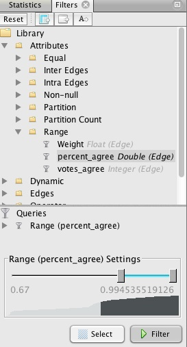

This will draw edges between Senators only if they voted the same way in at least two-thirds of the votes in 2013. Hit `Filter`, and watch many of the edges disappear. Switch to the `Data Laboratory` view, and see how the `Edges` table has also changed. Now return to the `Overview`, `Run` the layout algorithm again, and the graph should change to look something like this:


Now the network is organized into two clusters, which are linked through only a single Senator. These are presumably Democrats and Republicans, which we can confirm by coloring the nodes by party in the `Partition` tab at top left:


To customize the colors, click on each square in the `Partition` tab, then `Shift-Ctrl` and click to call up the color selector:

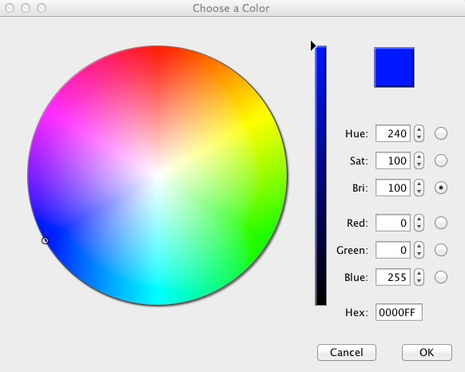

Make Democrats blue (Hex: `0000FF`), Republicans red (Hex: `FF0000`) and the two Independents orange (Hex: `FFAA00`).

Let's also reconfigure the network so that the Democrats are on the left and the Republicans on the right. `Run` the layout algorithm again, and with it running, click and drag one of the outermost Democrats, until the network looks something like this:

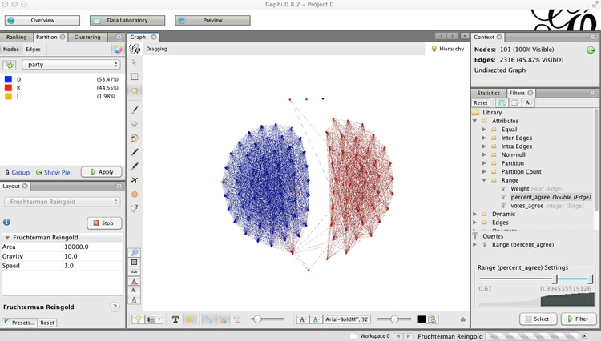

Now is a good time to save the project, if you have not done so already.

Next we will calculate some metrics for our new, filtered network. If we are interested in highlighting the Senators who are most bipartisan, then Betweenness centrality is a good measure -- remember that it highlights "bridging" nodes that prevent the network from breaking apart into isolated clusters.

Select the `Statistics` tab in the main right-hand panel, and then `Edge Overview>Avg. Path Length>Run`. Click `OK` at the next dialog box, close the `Graph Distance Report`, and go to the `Data Laboratory` view. Notice that new columns, including `Betweenness Centrality`, have appeared in the `Nodes` table:


Switch back to the `Overview`, and select the `Ranking` tab on the top left panel. Choose `Betweenness Centrality` as the ranking parameter for `Nodes`, select the gem-like icon (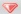), which controls the size of nodes, and select a minimum and maximum size for the range.


Click `Apply`, and the network should look something like this:


You may at this point want to switch on the labels, and note that [Susan Collins](http://www.collins.senate.gov/), the Republican from Maine, was the standout bipartisan Senator in 2014.

Now switch to `Preview`, which is where the appearance of the network graph can be polished before exporting it as a vector graphic. Click `Refresh` to see the network graphic drawn with default options:

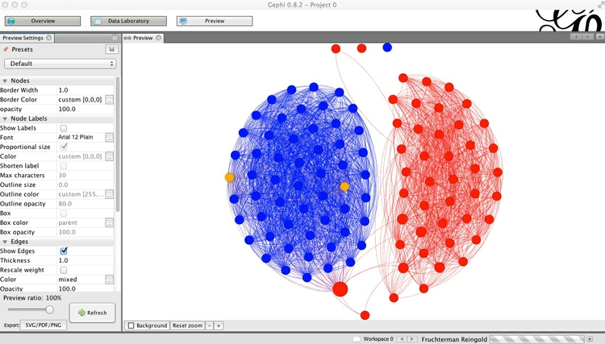

You can then customize using the panel on the left, clicking `Refresh` to review each change. Here I have removed the nodes' borders, by setting their width to zero, changed the edges from the default curved to straight, and reduced edge thickness to 0.5:

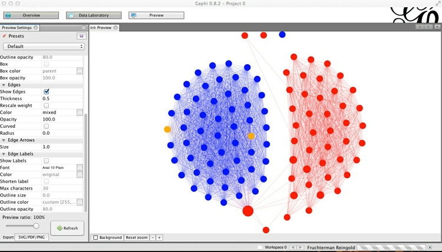

### Export the finished network as vector graphics and for online visualization

Export the network graph in SVG or PDF format using the button at bottom left, or by selecting `File>Export>SVG/PDF/PNG file...` from the top menu.

Now select `File>Export>Graph file...` and save as JSON (this option is available through the JSONExporter plugin we installed earlier). Make sure to select `Graph>Visible only` at the dialog box, so that only the filtered network is exported:


Now try to repeat the exercise with the 2013 data!

### Introducing Sigma.js

Network graphs can be visualized using several JavaScript libraries including [D3](http://d3js.org/) (see [here](http://bl.ocks.org/mbostock/4062045) for an example). However, we will use the [Sigma.js](http://sigmajs.org/) JavaScript library, which is specifically designed for the purpose, and can more easily handle large and complex networks.

### Make your own Sigma.js interactive network

I have provided a basic Sigma.js template, prepared with the generous help of [Alexis Jacomy](http://www.medialab.sciences-po.fr/people/alexis-jacomy/), the author of Sigma.js. This is in the `senate` folder.

Save the JSON file you exported from Gephi in the `data` subfolder with the name `senate.json`, then open the file `index.html`. The resulting interactive should look like this. Notice that when you hover over each node, its label appears, and its direct connections remain highlighted, while the rest of the network is grayed out:


Open `index.html` in your preferred text editor, and you will see this code:

```HTML
<!DOCTYPE html>
<html>

<head>

  <meta charset=utf-8 />
  <title>U.S. Senate network</title>
  <meta name="viewport" content="width=device-width, initial-scale=1.0, maximum-scale=1.0, user-scalable=no" />
  <script src="src/sigma.min.js"></script>
  <script src="src/sigma.parsers.json.min.js"></script>

  <style>
    body {margin:0; padding:0;}
    #sigma-container {position:absolute; top:0; bottom:0; width:100%;}
  </style>

</head>

<body>
  <div id="sigma-container"></div>

  <script>
  function init() {

    // Finds the connections of each node
    sigma.classes.graph.addMethod("neighbors", function(nodeId) {
      var k,
          neighbors = {},
          index = this.allNeighborsIndex[nodeId] || {};

      for (k in index)
        neighbors[k] = this.nodesIndex[k];

      return neighbors;
    });

   // Creates an instance of Sigma.js
    var sigInst = new sigma({
      renderers: [
        {
          container: document.getElementById("sigma-container"),
          type: "canvas"
        }
      ]
    });

    // Customizes its settings 
    sigInst.settings({
      // Drawing properties :
      defaultLabelColor: "#000",
      defaultLabelSize: 14,
      defaultLabelHoverColor: "#fff",
      labelThreshold: 11,
      defaultHoverLabelBGColor: "#888",
      defaultLabelBGColor: "#ddd",
      defaultEdgeType: "straight",

      // Graph properties :
      minNodeSize: 3,
      maxNodeSize: 10,
      minEdgeSize: 0.1,
      maxEdgeSize: 0.2,

      // Mouse properties :
      zoomMax: 20 
    });

    // Parses JSON file to fill the graph
    sigma.parsers.json(
      "data/senate.json",
      sigInst,
      function() {
		//  Little hack here:
		//  In the latest Sigma.js version have to delete edges" colors manually
        sigInst.graph.edges().forEach(function(e) {
          e.color = null;
        });

        // Also, to facilitate the update of node colors, store
        // their original color under the key originalColor:
        sigInst.graph.nodes().forEach(function(n) {
          n.originalColor = n.color;
        });

        sigInst.refresh();
      }
    );


     // When a node is clicked, check for each node to see if it is connected. If not, set its color as gray
     // Do the same for the edges

    var grayColor = "#ccc";
    sigInst.bind("overNode", function(e) {
      var nodeId = e.data.node.id,
          toKeep = sigInst.graph.neighbors(nodeId);
      toKeep[nodeId] = e.data.node;

      sigInst.graph.nodes().forEach(function(n) {
        if (toKeep[n.id])
          n.color = n.originalColor;
        else
          n.color = grayColor;
      });

      sigInst.graph.edges().forEach(function(e) {
        if (e.source === nodeId || e.target === nodeId)
          e.color = null;
        else
          e.color = grayColor;
      });

    // Since the data has been modified, call the refresh method to make the colors update 
      sigInst.refresh();
    });

    // When a node is no longer being hovered over, return to original colors
    sigInst.bind("outNode", function(e) {
      sigInst.graph.nodes().forEach(function(n) {
        n.color = n.originalColor;
      });

      sigInst.graph.edges().forEach(function(e) {
        e.color = null;
      });

      sigInst.refresh();
    });
  }

  if (document.addEventListener)
    document.addEventListener("DOMContentLoaded", init, false);
  else
    window.onload = init;
  </script>

</body>

</html>
```

The code has been documented to explain what each part does. Notice that the head of the web page loads the main Sigma.js script, and a second script that reads, or "parses," the json data. These are in the `src` subfolder.

To explore Sigma.js further, download or clone its [Github repository](https://github.com/jacomyal/sigma.js) and examine the code for the examples given.

### Further reading/resources

[Gephi tutorials](https://gephi.github.io/users/)

[Sigma.js wiki](https://github.com/jacomyal/sigma.js/wiki)
