# Making maps with QGIS

### Introducing QGIS

[**GQIS**](http://qgis.org/en/site/) is the leading free, open source Geographic Information Systems (GIS) application. It is capable of sophisticated geodata processing and analysis, and also can be used to design publication-quality data-driven maps.

The possibilities are almost endless, but you don't need to be a GIS expert to put it to effective use for both displaying geographic data.

Launch QGIS, and you should see a screen like this:

### The data we will use

Download the data from this session from [here](data/qgis.zip), unzip the folder and place it on your desktop. It contains the following files:

- `CA_counties_medicare` Shapefile with data on Medicare reimbursement per enrollee by California county in 2012, from the [Dartmouth Atlas of Healthcare](http://www.dartmouthatlas.org). Includes the following fields:
 - `enrollees` Medicare enrollees in 2012.
 - `total` Total Medicare reimbursements per enrollee.
 - `hospital` Hospital & skilled nursing facility reimbursements per enrollee.
 - `physician` Physician reimbursements per enrollee.
 - `outpatient` Outpatient facility reimbursements per enrollee.
 - `homehealth` Home health agency reimbursements per enrollee.
 - `hospice` Hospice reimbursements per enrollee.
 - `medequip` Durable medical equipment reimbursements per enrollee.
- `Healthcare_Facility_Locations.csv` Locations of hospitals and other healthcare facilities in California, from the [California Department of Public Health](https://cdph.data.ca.gov/Facilities-and-Services/Healthcare-Facility-Locations/tjeb-68c7).

### Map Medicare reimbursements and hospital locations and capacities in California

#### Make a choropleth map showing Medicare reimbursements by county

Choropleth maps fill areas with color, according to values in the data.

We will first import the shapefile in the `CA_counties_medicare` folder.

Select `Layer>Add vector layer` or click on this icon:

At the dialog box, click `Browse` and navigate to the file `seismic_risk_clip.shp`. It is important that you select the file with the `.shp` extension. Then click open, and the following map of California should appear, filled with a random color:

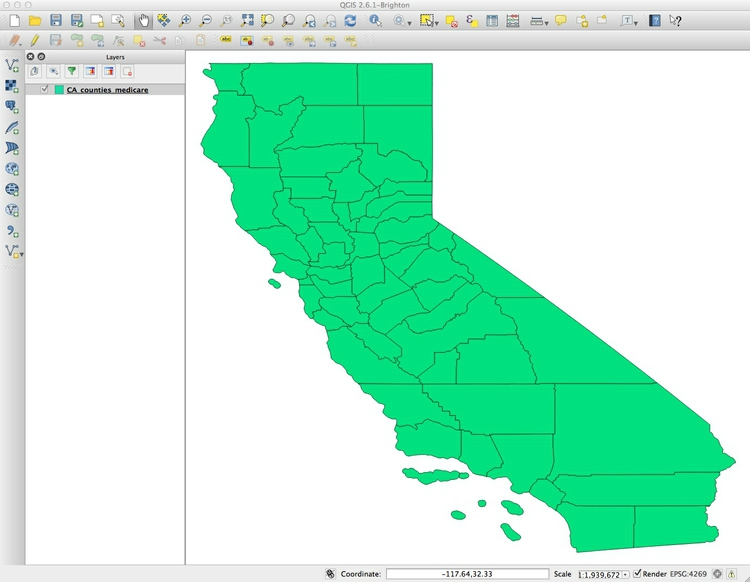

You can turn off the visibility of any layer by unchecking its box in the `Layers` panel. This can be useful to see the status of layers that would otherwise be obscured.

These controls allow you to pan and zoom the display:

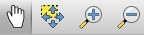

You can focus the display on the full extent of any layer by right-clicking it in the `Layers` panel and selecting `Zoom to layer`.

Notice `EPSG:4269` at the bottom right. This defines the map projection and datum for the layer. (A datum is a mathematical model accounting for the shape of the Earth — which is not a perfect sphere.)

Right-click on `CA_counties_medicare` in the `Layers` panel at left and select `Properties>General`. You should see the following under `Coordinate reference system`:

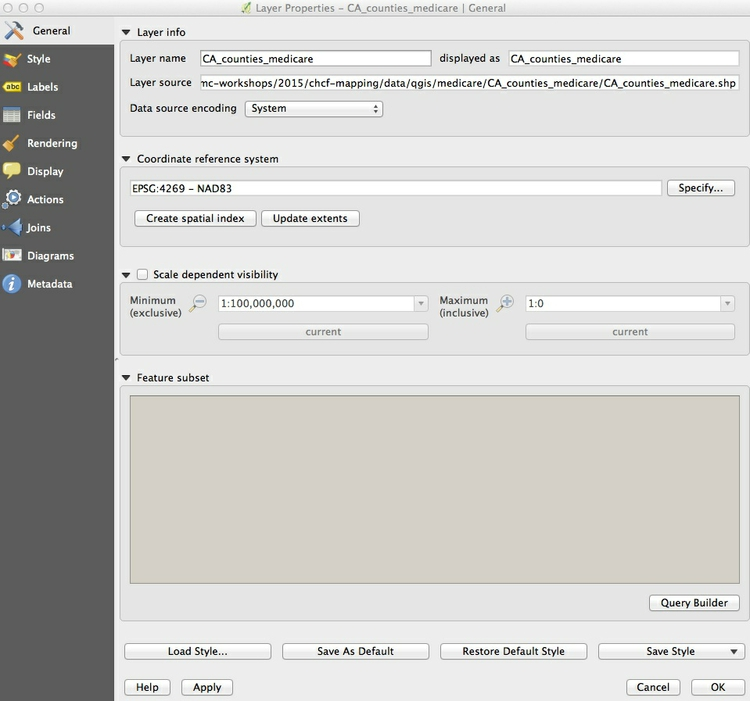

`EPSG:4269` and `NAD83` mean that this shapefile is in an [Equirectangular projection](http://en.wikipedia.org/wiki/Equirectangular_projection), and the [NAD83](http://en.wikipedia.org/wiki/North_American_Datum) datum.

(The Equirectangular projection, which draws a map with degrees of latitude and longitude the same size across the entire globe, is also the default for QGIS if no projection is specificied.)

We will select another projection for our map later. Click `Cancel` or `OK` to close `Properties` for this layer.

Now we need to color the areas for the `CA_counties_medicare` layer by values in the data. Right-click on it in the `Layers` panel and select `Open Attribute Table`, which corresponds to the `.dbf` of the shapefile:

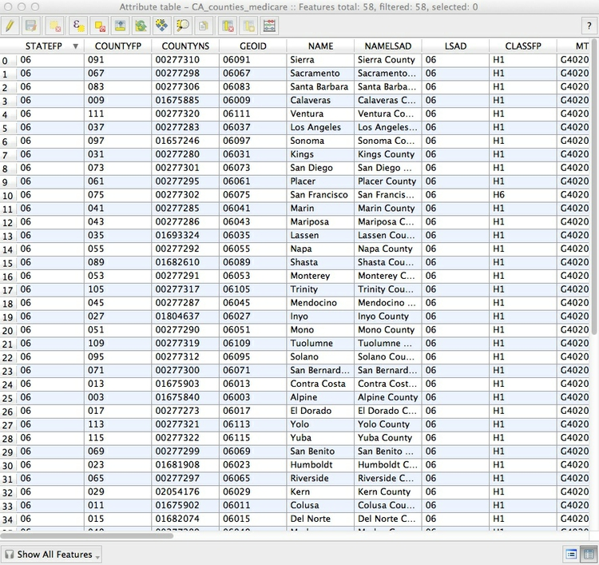

Scroll to the right of the table to see the fields detailing various categories of Medicare reimbursement:

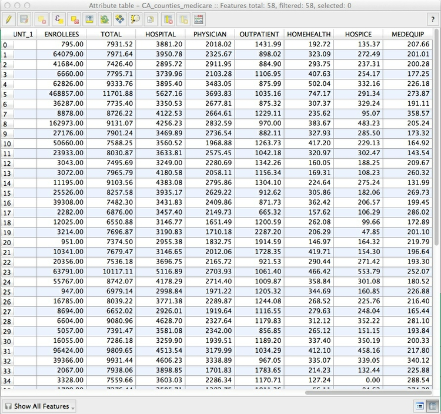

We are going to make a choropleth map of reimbursements per enrollee for hospitals and skilled nursing facilities, in the `hospital` field.

To do this, close the attribute table and call up `Properties>Style` for the `CA_counties_medicare` layer. Select `Graduated` from the dropdown menu at top, which is the option to color data according to values of a continuous variable. Select `5` under `Classes`, and then `New color ramp...` under `Color ramp`. While QGIS has many available color ramps, we will use this opportunity to call in a [ColorBrewer](http://colorbrewer2.org/) sequential color scheme. (ColorBrewer's suggestions have been rigorously researched to be maximally informative and intuitive.) At the dialog box select `ColorBrewer` and then `Reds`, and then click `OK`:

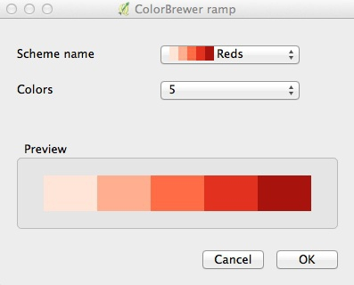

You will need to give the color ramp a name -- the default `Reds5` is fine. Select `HOSPITAL` under `Column`, and select `Quantile (Equal Count)` for `Mode`. This menu gives various options for automatically setting the boundaries between the five classes or bins. Then click the `Classify` button to produce the following display:

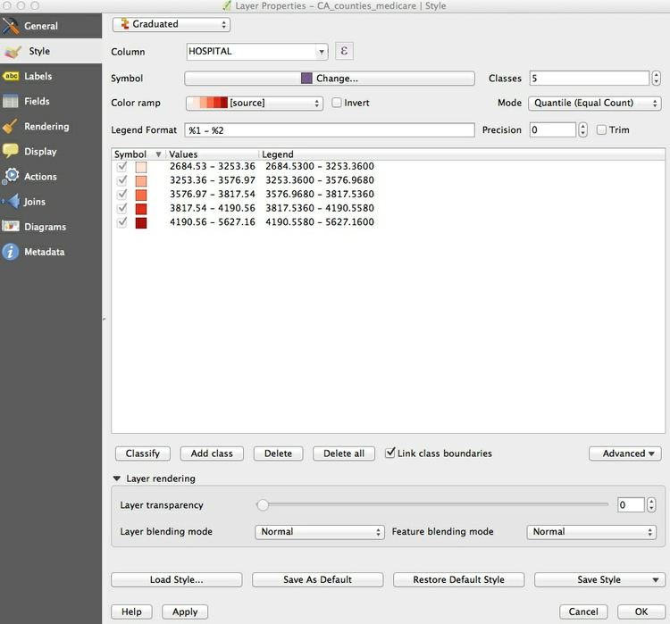

Now let's edit the breaks manually to use values guided by the quantiles, but which will be easier for users to process when reading the map legend.

Double-click on the first symbol and select `3250` for the `Upper value` and click `OK`. Then double-click on the `Label` for this symbol and edit the text to `< $3,250`. Carry on editing the values and labels until the display looks like this:

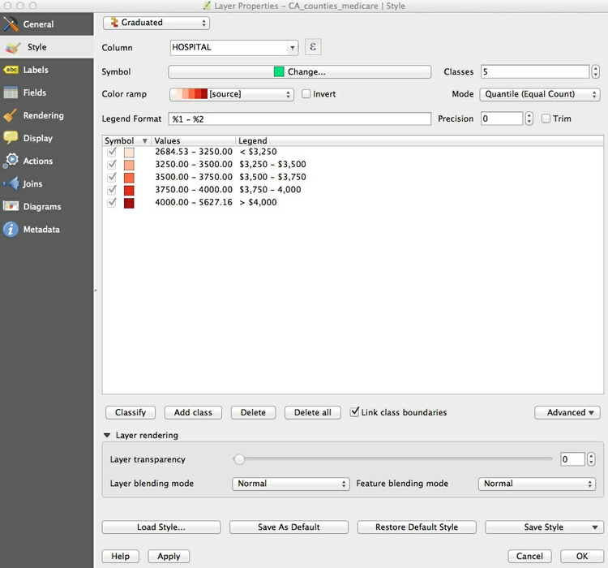

Click `OK` and the map should look like this:

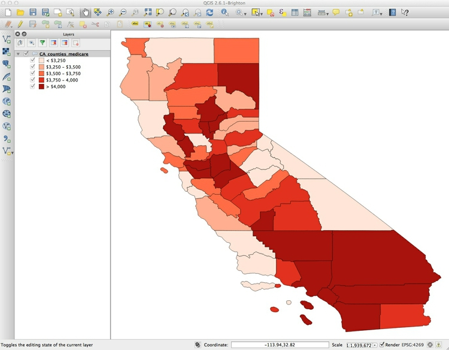

I often prefer white boundaries on a choropleth map. So open up the `Style` tab under `Properties` once more and click on `Symbol>Change...`. Then select `Simple fill`, click on the color for `Border` and in the color wheel tab of the color picker, change the color to white, by moving each of the RGB sliders to `255`:

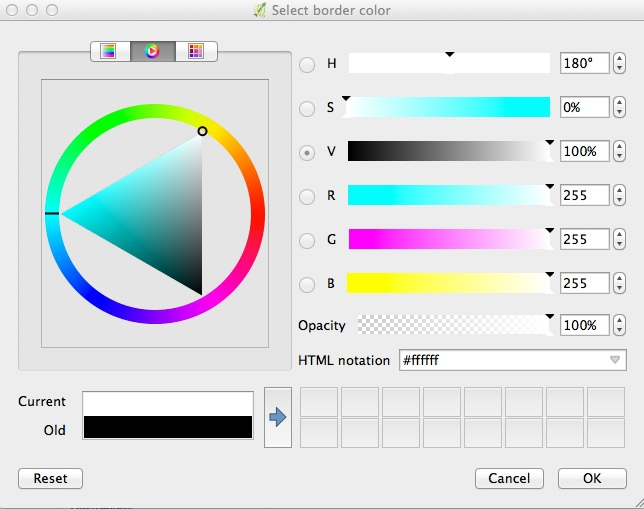

Click on `Symbol>Change` once more, and and set the `Transparency` to 50%. This will keep the relative distinctions between the colors, but tone them down a little so they don't dominate the layer we will later plot on top.

If you are likely to want to style data in the same format in the same way in future, it is a good idea to click the `Save Style` button at bottom right and save as a `QGIS Layer Style File`, which is a variant of [XML](http://www.w3.org/XML/). When loaded using the `Load Style ...` button at bottom left, it will automatically apply the saved styling to future maps.

The map should now look like this:

To add labels to the map, select `Properties>Labels` and fill in the dialog box. Here I am adding a `NAME` label to each county, using `Arial` font, `Italic` style at a size of `11` points and with the color set to a HEX value of `#4c4c4c` for a dark gray:

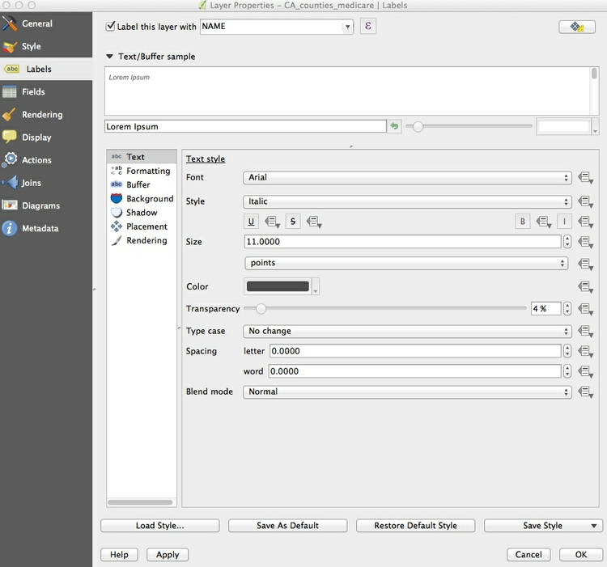

Click `OK` and the map should now look like this:

Save the project, by selecting `Project>Save` from the top menu.

Now is a good time to give the project a projection: We will use variant of the [Albers Equal Area Conic projection](http://en.wikipedia.org/wiki/Albers_projection), optimized for maps of California.

Select `Project>Project Properties>CRS` (for Coordinate Reference System) from the top menu, and check `Enable 'on the fly' CRS transformation`. This will convert any subsequent layers we import into the Albers projection, also.

Type `Albers `into the `Filter` box and select `NAD83(HARN)/ California Albers`, which has the code `EPSG:3311`:

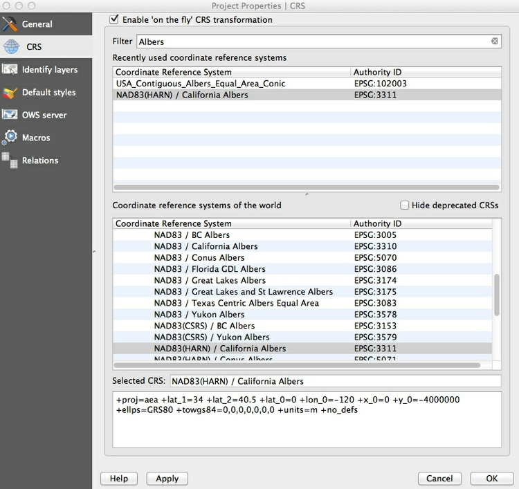

Click `OK` and the map should reproject. Notice how `EPSG:3311` now appears at bottom right:

#### Add a layer showing locations and capacities hospitals/skilled nursing facilities

To import a CSV or other delimited text file with points described by latitude and longitude coordinates, select `Layer>Add Delimited Text Layer` from the top menu or click this icon:

`Browse` to the file `Healthcare_Facility_Locations.csv`, and ensure that the dialog box is filled in like this:

If your file is not a CSV you will have to select the correct delimiter, and if your latitude and longitude fields have other names, you may have to select the `X field` (longitude) and `Y field` (latitude) manually.

When you click `OK` you will be asked to select a projection, or CRS, for the data. You may be tempted to select the same Albers projection we have set for the project, but this will cause an error. QGIS will handle the conversion to that projection: Because this data is not yet projected, we should instead select a datum with a default Equirectangular projection, either `WGS 84 EPSG:4326` or `NAD83 EPSG:4297`.

Click `OK` and a large number of points will be added to the map:

Now we will style these points, using color to distinguish hospitals from skilled nursing facilities, removing other facilities from the map, and scaling the circles according to the capacity of each facility.

Select `Properties>Style` for the `Healthcare_Facility_Locations` layer, and accept `Categorized` from the top dropdown menu. Select`TYPE` under `Column` and then hit the `Classify` button. (Keeping `Random colors` for the `Color ramp` is fine, as we will later edit the colors manually). Select and then `Delete` facilities other than `General Acute Care Hospital` and `Skilled Nursing Facility`, as follows:

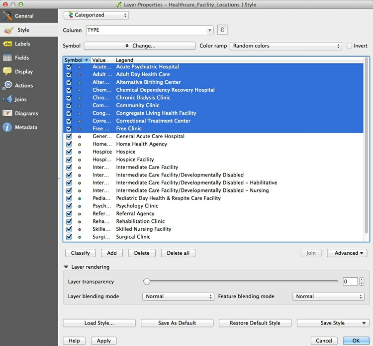

You should be left with the following:

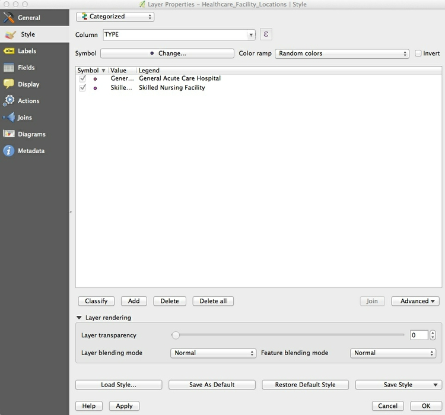

Now click the `Advanced` button to the right and select `Size scaled field`, making sure `Scale area` is checked (this will ensure that the circles we are about to draw scale correctly, by area) and check `CAPACITY` to select that as the field to scale the size of the circles. Click `OK` and the map should look like this:

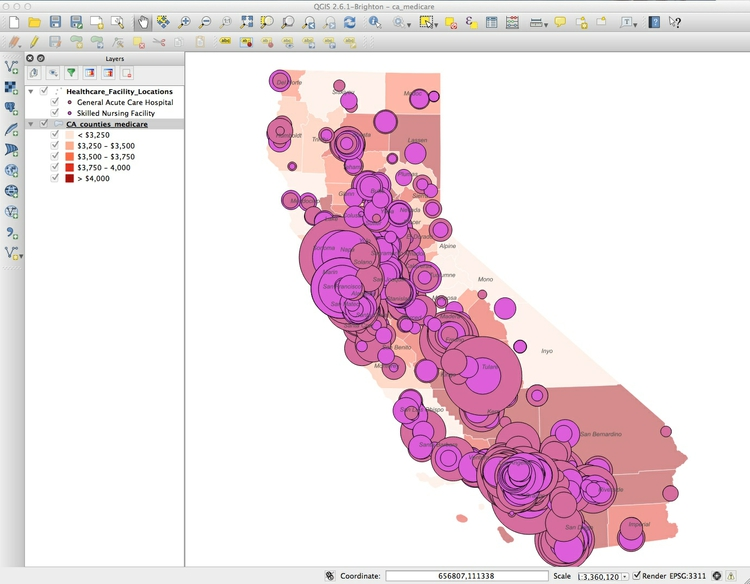

The relative sizes of the circles are fine, but they are too big.

To fix this, return to `Properties>Style>Advanced`, then select
`- expression -` and fill in the dialog box as follows:

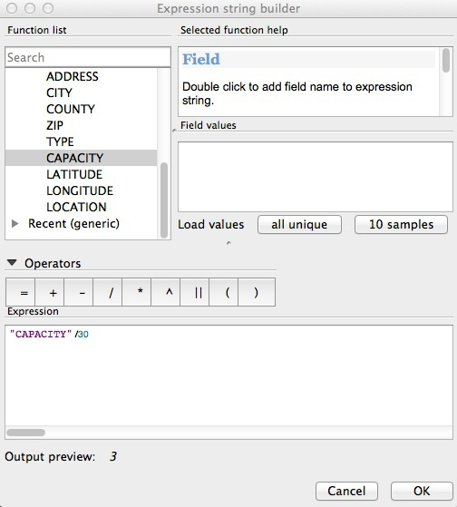

Here we are simply dividing the numbers in the `CAPACITY` field by 30, which I have found through trial-and-error gives a reasonable display.

In the main `Style` tab, click on each point symbol and select `Simple marker` to edit its color. Also set transparency for the symbols to 50%, as we did for the choropleth map.

The final map should look like this:

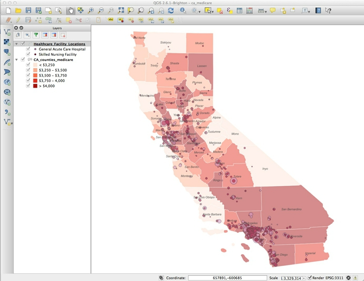

#### Export the finished map in raster image or vector graphic formats

We will export our finished map with a legend explaining the colors, so let's change the name of the fields so they display nicely. Right-click on each layer and rename them `Facility type` and `Medicare reimbursement per enrollee` respectively.

To export the map, select `Project>New Print Composer`, give the composer an appropriate name and click `OK`. In the print composer window, select the following options in the `Composition` tab:

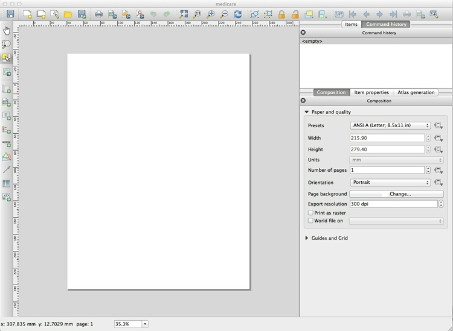

Now click the `Add new map` icon:

Draw a rectangle over the page area, and the map should appear, You can edit its size, and adjust its position, as desired:

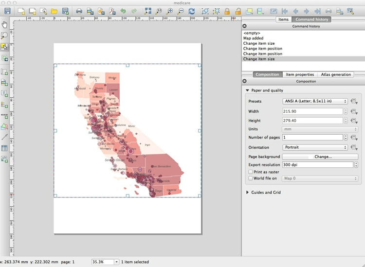

Once you are statisfied with the appearance of your map in the print composer, click the `Add legend` icon:

Draw a rectangle on the page where you want the legend to appear:

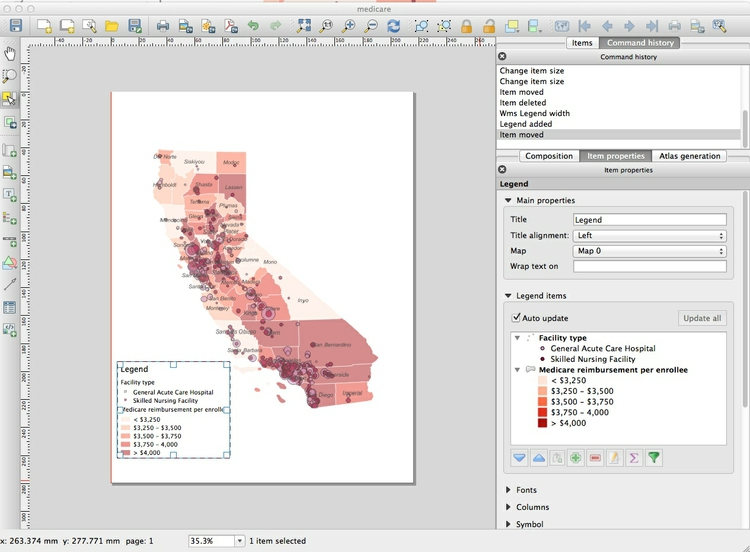

In the `Item properties` tab, edit `Fonts` and other options as desired. Here I have simply deleted the default `Title` of `Legend`:

You can save your maps in raster image formats (JPG, PNG etc) from the Print Composer by clicking the `Save Image` icon:

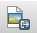

The map can be exported in SVG and PDF vector formats by clicking these export icons:

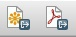

Note that the SVG export may not clip the map to the page exactly. However, this can be fixed in a vector graphics editor such as [Adobe Illustrator](http://www.adobe.com/products/illustrator.html) or [Inkscape](https://inkscape.org/en/), and then saved as a PDF. This may provide a better rendering of the map than through a direct PDF export.

You can also save as an image from the main map display (so without any legend and annotation added in the Print Composer) by selecting `Project>Save as Image` from the top menu.

Save the QGIS project, and then select `Project>Close` to close.

### Further reading

[QGIS Training Manual](http://docs.qgis.org/2.2/en/docs/training_manual/)

[QGIS User Guide](http://docs.qgis.org/2.2/en/docs/user_manual/)

[A Gentle Introduction to GIS](http://docs.qgis.org/2.2/en/docs/gentle_gis_introduction/)

