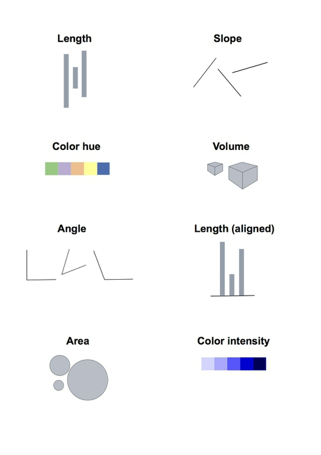
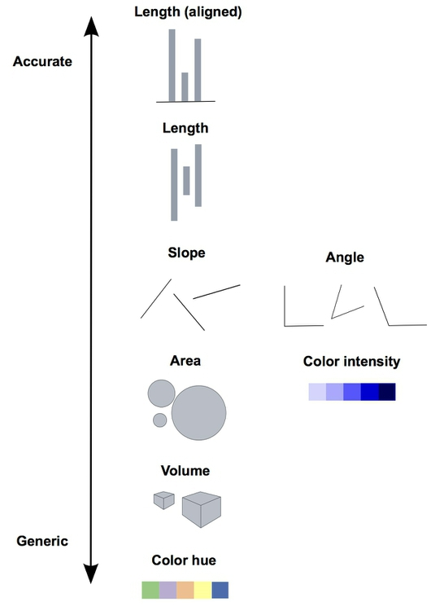
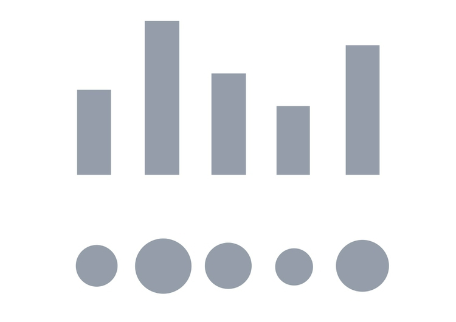
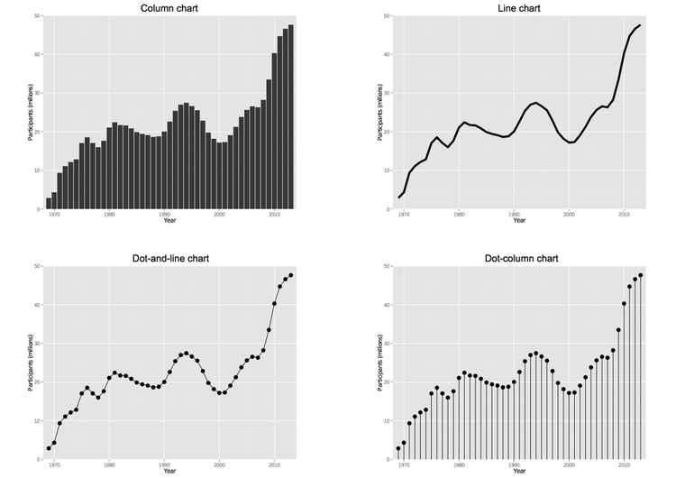
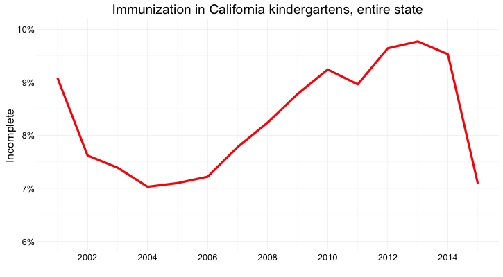
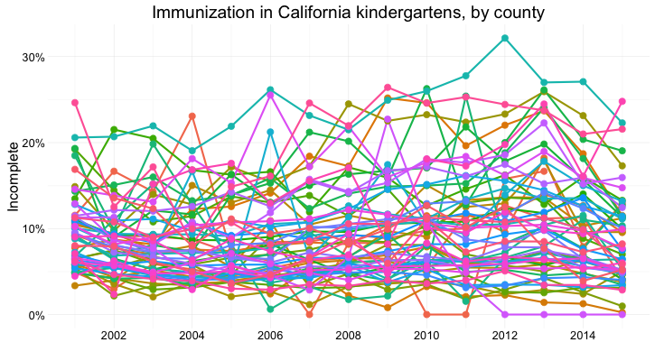
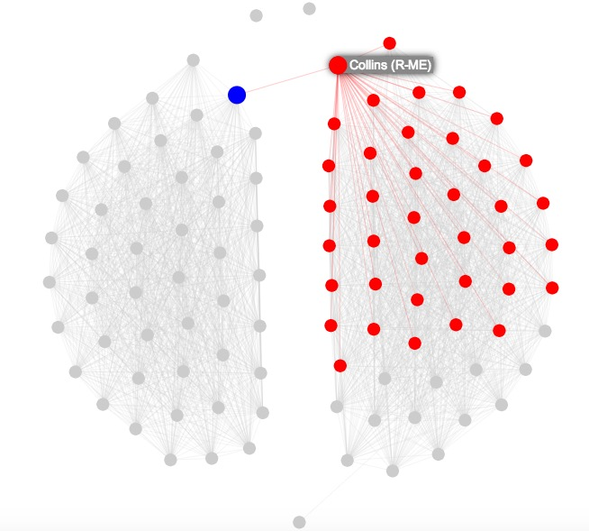
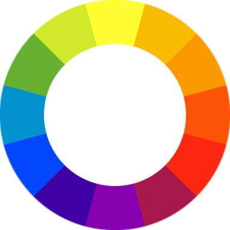
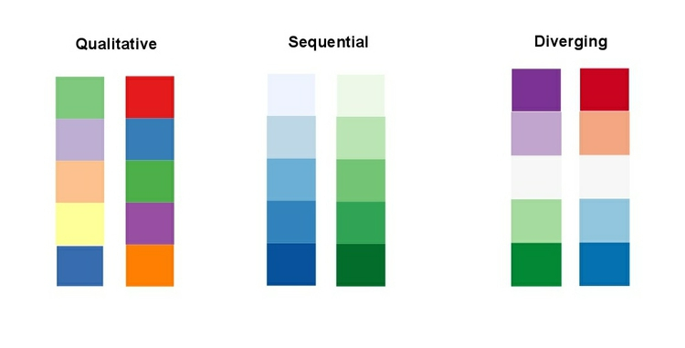

# Which, chart should I use, and why? Information design for the human brain

Visualizating data is a good way to communicate complex information, because we are highly visual animals, evolved to spot patterns and make visual comparisons. To visualize effectively, however, it helps to understand a little about how our brains process visual information. The mantra for the this panel is: Design for the human brain!

### Visualization: encoding data using visual cues

Whenever we visualize, we are encoding data using visual cues, or "mapping" data onto variation in size, shape or color, and so on. There are various ways of doing this, as this primer illustrates:

These cues are not created equal, however. In the mid-1980s, statisticians William Cleveland and Robert McGill [ran some experiments](http://courses.ischool.berkeley.edu/i247/f05/readings/Cleveland_GraphicalPerception_Science85.pdf) with human volunteers, measuring how accurately they were able to esimate the numbers encoded by different visual cues. This is what they found:

The position of points on an aligned scale is perceived with similar accuracy to the length of a line -- we don't need to see a solid line to accurately read the distance between an axis, and a point on a scatter plot.

This perceptual hierarchy of visual cues is very important. When making comparisons with continuous variables (numbers on a sliding scale), aim to use cues near the top of the scale wherever possible.

Look at the following visual encodings of the same simple dataset. Do the bars, or the circles, make it easiest to "read" the numerical values that are encoded?

### But this doesn't mean that everything becomes a bar chart

Length on an aligned scale may be the best option to allow people to compare numbers accurately, but that doesn't mean the other possibilities are always to be avoided in visualization. Indeed, color hue is a good way of encoding categorical data (labels that assign data records to different groups). The human brain is particularly good at recognizing patterns and differences. This means that variations in color, shape and orientation, while poor for accurately encoding the precise value of continuous variables, can be good choices for representing categorical data.

You can also combine different visual cues into the same graphic to encode different variables. But always think about the main messages you are trying to impart, and where you can use visual cues near the top of the visual heirarchy to communicate that message most effectively.

### Visualizing change over time

Visualizing change over time is a very common task in journalism.

Bar or column charts can be used to illustrate this, but there are other possibilities, as shown in these charts showing participation in the federal government’s food stamps nutritional assistance program, from 1969 to 2014.

Each of these charts communicates the same basic information with a subtly different emphasis. The column chart emphasizes each year as a discrete point in time, while the line chart focuses on the overall trend or trajectory. In doing so, it uses the cue of slope to encode the rate of change over time. So think about whether the values in any given year, or the rate of change from year to year, is most important to your story.

The dot-and-line chart is a compromise between these two approaches, showing the trend while also drawing attention to the value for each year using the cue of the points' position on an aligned scale.

(The dot-column or lollipop chart is an unusual variant of a column chart, included here to show another possible design approach to the same visual encoding.)

### Case study: Immunization in California kindergartens

Now we'll explore a dataset at different levels of analysis, to show how different visual encodings may be needed for different visualization tasks with the same data.

This data, from the [California Department of Public Health](https://www.cdph.ca.gov/programs/immunize/Pages/ImmunizationLevels.aspx), gives numbers on immunization and enrollment at kindergartens across the state. The data is provided at the level of individual schools, but can be aggregated to look at counties, or the entire state.

When looking at change over time at the state level, the perceptual hierarchy makes a bar chart a good choice:

Notive that I've focused on the percentage of children with *incomplete* vaccination, rather than the percentage complete, for two reasons: 
- The differences between the lengths of the bars are greater, and so is easier to read. 
- More imporantly, incomplete vaccination is what increases the risk of infectious disease, which is why we care as journalists about this data.

But as for the food stamps data, a bar chart is not the only choice:

Here's the same information presented as a line chart:

Notice that here, I haven't started the Y axis at zero. This would be unforgiveable for a bar chart, where the length of the bar is the visual encoding, and so starting at an arbitrary value would distort the comparison between the bars. Here, however, I'm emphasizing the relative slope, to show change over time, so starting at zero is less crucial.

And here's the data as a dot-and-line chart:

Here, I've returned to a Y axis that starts at zero, so that the relative positions of the points can be compared accurately.

But what if we want to look at individual counties? When comparing a handful of counties, the dot-and-line chart, combining the visual cues of position on an aligned scale (for the yearly values) and slope (for the rate of change from year to year) works well:

But there are 58 counties in California, and trying to compare them all using a dot-and-line chart results in chaos:

In this case, it makes sense to drop down the perceptual hierarchy, and use the intensity of color to repesent the percentage of incomplete immunization:

This type of chart is called a heat map. It provides a quick and easy way to scan for the counties and years with the highest rates of incomplete immunization.

What if we want to visualize the data for every kindergarten on a single chart, to give an overview of how immunization rates vary across schools?

Here's my best attempt at this:

Here I've drawn a circle for every school, and used their position on an aligened scale, along the Y axis, to encode the percentage of incomplete immunization. I've also used the area of the circles to encode the enrollment at each kindergarten -- but this is secondary to the chart's main message, which is about the variation of immunization rates across schools.

### Which type of chart should I use?

This is a frequently asked question, and the best answer is: Experiment with different charts, keeping in mind the perceptual hierarchy, to see which works best to liberate the story in your data, as I did above. Some visualization software -- notably [Tableau Public](http://www.tableausoftware.com/public//) -- will suggest chart types for you to try. However, it is good to have a basic framework to help you prioritize particular chart types for particular visualization tasks. Although it is far from comprehensive, and makes some specific chart suggestions that I would not personally endorse, the ["chart of charts"](http://extremepresentation.typepad.com/files/choosing-a-good-chart-09.pdf) published on the Extreme Presentation Method website provides a useful framework by providing answers to the question: "What would you like to show?"

It considers four possible answers: the **distribution** of a single continuous variable; the **relationship** between two continuous variables;  **comparisons** between items for a continuous variable; and **composition**, or how parts make up the whole.

I like to add a couple more answers to the question: **connection**, or visualizing how people, things, or organizations relate to one another; and **location**, which covers maps.

Maps need no introduction, but network graphs are less familiar. Journalists are frequently interested in exploring connections -- which donors gave money to which candidate, how companies are connected through members of their boards, and so on. Network graphs can visualize these questions, as in this example from yesterday's [Gephi hands-on session](gephi.html), showing patterns of voting in the U.S. Senate in 2015:

Here the network graph highlights the Senators who at least two-thirds of the time voted the same way as Republican Senator Susan Collins of Maine.

### Using color effectively

Color falls low on the perceptual hierarchy of visual cues, but as we have already seen, it can be a very useful encoding.

It helps to think about colors in terms of the color wheel, which places colors that harmonize well together side by side, and arranges those that have strong visual contrast -- blue and orange, for instance -- at opposite sides of the circle:

(Source: [Wikimedia Commons](http://commons.wikimedia.org/wiki/Category:Colorwheels#mediaviewer/File:Byrcolorwheel.png))

When encoding data with color, take care to fit the color scheme to your data, and the story you're aiming to tell. As we have already seen, color is often used to encode the values of categorical data. Here you want to use "qualitative" color schemes, where the aim is to pick colors that will be maximally distinctive, as widely spread around the color wheel as possible.

When using color to encode continuous data, it usually makes sense to use increasing intensity, or saturation, of color to indicate larger values. These are called "sequential" color schemes:

In some circumstances, you may have data that has positive and negative values, or which highlights deviation from a central value. Here, you should use a "diverging" color scheme, which will usually have two colors reasonably well separated on the color wheel as its end points, and cycle through a neutral color in the middle:

Here are some examples of qualitative, sequential and diverging color schemes:

Choosing color schemes is a complex science and art, but there is no need to "roll your own" for every graphic you make. Many visualization tools include suggested color palettes, and I often make use of the [ColorBrewer](http://colorbrewer2.org/) website. Orginally designed for maps, but useful for charts in general, these color schemes have been sibjected to rigorous perceptual tests to be maximally informative. Again, they have been designed for the human brain!

I'd urge against doing so, but if you need to roll your own color scheme, try experimenting with [I want hue](http://tools.medialab.sciences-po.fr/iwanthue) for qualitative color schemes, the [Chroma.js Color Scale Helper](https://vis4.net/labs/multihue/) for sequential schemes, and this [color ramp generator](http://www.zonums.com/online/color_ramp/), in combination with [Colorizer](http://colorizer.org/) or another online color picker, for diverging schemes.

ColorBrewer also allows you to select color schemes that are colorblind safe. Surprisingly, many news organizations persist in using color schemes that exclude a substantial minority of their audience. Red and green lie on opposite sides of the color wheel, and also can be used to suggest "good" or "go," versus "bad" or "stop." But about 5% of men have red-green colorblindness, also known as deuteranopia.

Install [Color Oracle](http://www.colororacle.org/index.html) to simulate how your charts and maps will look to people with various forms of colorblindness.

### Take home message: Sketch and experiment to find and tell the story

There are many ways of visualizing the same data. Effective static graphics and interactives do not usually emerge fully formed. The best ones arise through sketching and experimentation.

As you sketch and experiment with data, use the framework suggested by the chart selector thought-starter to prioritize different chart types, and definitely keep the perceptual hierarchy of visual cues at the front of your mind. Remember the mantra: Design for the human brain!

Also, show your experiments to friends and colleagues. If people are confused or don't see the story, you may need to try a different approach.

### Further reading

Alberto Cairo: [*The Functional Art: An Introduction to Information Graphics and Visualization*](http://www.amazon.com/The-Functional-Art-introduction-visualization/dp/0321834739)

Nathan Yau: [*Data Points: Visualization That Means Something*](http://www.amazon.com/Data-Points-Visualization-Means-Something/dp/111846219X)
