# Data analysis in R

In today's class we will analyze data using **[R](http://www.r-project.org/)**, which is a very powerful tool, designed by statisticians for data analysis. Described on its website as "free software environment for statistical computing and graphics," R is a programming language that opens a world of possibilities for making graphics and analyzing and processing data. Indeed, just about anything you may want to do with data can be done with R, from web scraping to making interactive graphics.

Our focus today will be learning how to run **[SQL](https://en.wikipedia.org/wiki/SQL)**-like analysis in R using the **[dplyr](https://cran.rstudio.com/web/packages/dplyr/vignettes/introduction.html)** package, and making some simple charts using **[ggplot2](http://docs.ggplot2.org/current/)**.


### The data we will use today

Download the data for this session from [here](data/r-analysis.zip), and unzip the folder. This data should already be loaded on the machines at the NICAR meeting:


##### Health and wealth of nations

- `nations1.csv` Data from the [World Bank Indicators](http://data.worldbank.org/indicator/?tab=all) portal. Contains the following fields:
 -  `iso2c` `iso3c` Two- and Three-letter [codes](http://www.nationsonline.org/oneworld/country_code_list.htm) for each country, assigned by the [International Organization for Standardization](http://www.iso.org/iso/home/store/catalogue_tc/catalogue_detail.htm?csnumber=63545).
 - `country` Country name.
 - `year` From 1990 to 2015.
 - `population` Estimated [total population](http://data.worldbank.org/indicator/SP.POP.TOTL) at mid-year, including all residents apart from refugees.
 - `life_expect` [Life expectancy at birth](http://data.worldbank.org/indicator/SP.DYN.LE00.IN), in years.
 - `population` Estimated [total population](http://data.worldbank.org/indicator/SP.POP.TOTL) at mid-year, including all residents apart from refugees.
 - `birth_rate` [Live births during the year per 1,000 people](http://data.worldbank.org/indicator/SP.DYN.CBRT.IN), based on mid-year population estimate.
 - `neonat_mortal_rate` [Neonatal mortality rate](http://data.worldbank.org/indicator/SH.DYN.NMRT): babies dying before reaching 28 days of age, per 1,000 live births in a given year.
 - `region` `income` World Bank [regions and income groups](http://siteresources.worldbank.org/DATASTATISTICS/Resources/CLASS.XLS), explained [here](http://data.worldbank.org/about/country-and-lending-groups).

- `nations2.csv` Again from the World Bank Indicators portal. Contains the following fields:
 -  `iso3c` `year` As above.
 - `gdp_percap` [Gross Domestic Product per capita](http://data.worldbank.org/indicator/NY.GDP.PCAP.PP.CD) in current international dollars, corrected for purchasing power in different territories.

##### Immunization in California kindergartens

- `kindergarten.csv` Data from the [California Department of Public Health](https://www.cdph.ca.gov/programs/immunize/Pages/ImmunizationLevels.aspx), documenting enrollment and the number of children with complete immunizations at entry into kindergartens in California from 2001 to 2014. Contains the following variables:
  - `district` School district.
  - `sch_code` Unique identifying code for each school.
  - `pub_priv` Whether school is public or private.
  - `school` School name.
  - `enrollment` Number of children enrolled.
  - `complete` Number of children with complete immunizations.
  - `start_year` Year of entry (for the 2014-2015 school year, for example, this would be 2014).


- `kindergarten_2015.csv` As above, but data from 2015 only.


### Reproducibility: Save your scripts

Data journalism should ideally be fully documented and reproducible. R makes this easy, as every operation performed can be saved in a script, and repeated by running that script. Click on the  icon at top left and select `R Script`. A new panel should now open:


Any code we type in here can be run in the console. Hitting `Run` will run the line of code on which the cursor is sitting. To run multiple lines of code, highlight them and click `Run`.

Click on the save/disk icon in the script panel and save the blank script to the folder on your desktop continaing the data for this class, calling it `r-analysis.R`.

### Set your working directory

Now we can set the working directory to this folder by selecting from the top menu `Session>Set Working Directory>To Source File Location`. (Doing so means we can load the files in this directory without having to refer to the full path for their location, and anything we save will be written to this folder.)


### Save your data

The panel at top right has two tabs, the first showing the `Environment`, or all of the "objects" loaded into memory for this R session. We can save this as well, so we don't have to load and process data again if we return to return to a project later.

(The second tab shows the `History` of the operations you have performed in RStudio.)

Click on the save/disk icon in the `Environment` panel to save and call the file `r-analysis.RData`.

### Comment your code

Anything that appears on a line after `#` will be treated as a comment, and will be ignored when the code is run. Get into the habit of commenting your code: Don't trust yourself to remember what it does!

### Some R code basics

- `<-` is known as an “assignment operator.” It means: “Make the object named to the left equal to the output of the code to the right.”
- `&` means AND, in Boolean logic.
- `|` means OR, in Boolean logic.
- `!` means NOT, in Boolean logic.
- When referring to values entered as text, or to dates, put them in quote marks, like this: `"United States"`, or `"2016-07-26"`. Numbers are not quoted.
- When entering two or more values as a list, combine them using the function `c`, with the values separated by commas, for example: `c("2016-07-26","2016-08-04")`
- As in a spreadsheet, you can specify a range of values with a colon, for example: `c(1:10)` creates a list of integers (whole numbers) from one to ten.
- Some common operators:
 - `+` `-` add, subtract.
 -  `*` `/` multiply, divide.
 -  `>` `<` greater than, less than.
 -  `>=` `<=` greater than or equal to, less than or equal to.
 -  `!=` not equal to.
 -  `head(n)` and `tail(n)` extract the `n` first or last records from a object, respectively.

- Handling null values:
 - Nulls are designated as `NA`.
 - `is.na(x)` looks for nulls within variable `x`.
 - `!is.na(x)` looks for non-null values within variable `x`.

- Equals signs:

 -  `==` test whether an object is equal to a value. This is often used when filtering data, as we will see.
 -  `=` make an object equal to a value; works like `<-`, but used within the brackets of a function.

**Important:** Object and variable names in R should not contain spaces.

### Load R packages

Much of the power of R comes from the thousands of "packages" written by its community of open source contributors. These are optimized for specific statistical, graphical or data-processing tasks. To see what packages are available in the basic distribution of R, select the `Packages` tab in the panel at bottom right. To find packages for particular tasks, try searching Google using appropriate keywords and the phrase "R package."

In this class, we will work with three incredibly useful packages developed by [Hadley Wickham](http://hadley.nz/), chief scientist at RStudio:

- **[readr](https://cran.r-project.org/web/packages/readr/readr.pdf)** For reading and writing CSV and other text files.
- **[dplyr](https://cran.r-project.org/web/packages/dplyr/dplyr.pdf)** For processing and manipulating data.
- **[ggplot2](http://docs.ggplot2.org/current/)** Charting library, which builds graphics in layers according to a standard [grammar](http://vita.had.co.nz/papers/layered-grammar.pdf).

These and several other useful packages have been combined into a super-package called **[tidyverse](https://blog.rstudio.org/2016/09/15/tidyverse-1-0-0/)**.

To install a package, click on the `Install` icon in the `Packages` tab, type its name into the dialog box, and make sure that `Install dependencies` is checked, as some packages will only run correctly if other packages are also installed. Click `Install` and all of the required packages should install.

Each time you start R, it's a good idea to click on `Update` in the `Packages` panel to update all your installed packages to the latest versions.

Installing a package makes it available to you, but to use it in any R session you need to load it. You can do this by checking its box in the `Packages` tab. However, we will enter the following code into our script, then highlight these lines of code and run them:

```r
# load required packages
library(readr)
library(dplyr)
library(ggplot2)
```

At this point, and at regular intervals, save your script, by clicking the save/disk icon in the script panel, or using the `⌘-S/Ctrl-S` keyboard shortcut.


### Load and view data

#### Load data

You can load data into the current R session by selecting `Import Dataset>From Text File...` in the `Environment` tab.

However, we will use the `read_csv` function from the **readr** package. Copy the following code into your script and `Run`:

```r
# load health and wealth of nations data
nations1 <- read_csv("nations1.csv")
nations2 <- read_csv("nations2.csv")

```
Notice that the `Environment` now contains two objects, of the type `tbl_df`, a variety of the standard R object for holding tables of data, known as a **data frame**:

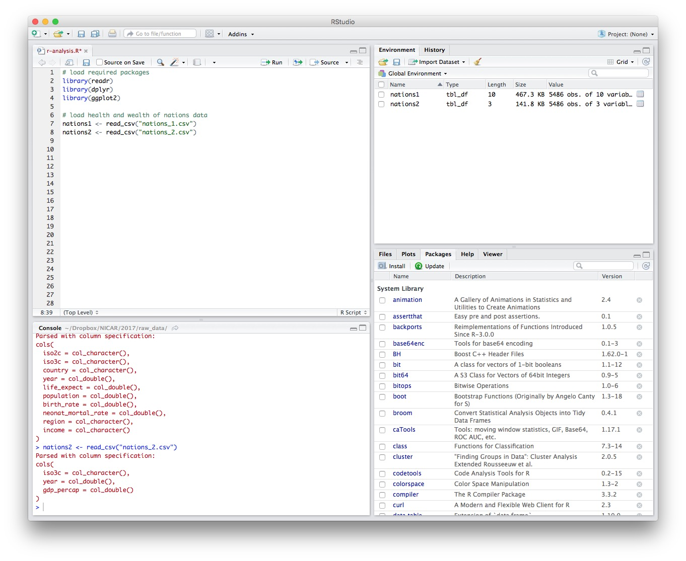

The `Value` for each data frame details the number of columns, and the number of rows, or observations, in the data.

You can remove any object from your environment by checking it in the `Grid` view and clicking the broom icon.


#### Examine the data

We can `View` data at any time by clicking on its table icon in the `Environment` tab in the `Grid` view.

The `str` function will tell you more about the columns in your data, including their data type. Copy this code into your script and `Run`:

```r
# view structure of data
str(nations1)
```
This should give the following output in the R Console:

```JSON
Classes ‘tbl_df’, ‘tbl’ and 'data.frame':	5486 obs. of  10 variables:
 $ iso2c             : chr  "AD" "AD" "AD" "AD" ...
 $ iso3c             : chr  "AND" "AND" "AND" "AND" ...
 $ country           : chr  "Andorra" "Andorra" "Andorra" "Andorra" ...
 $ year              : num  1994 1995 2006 2007 1996 ...
 $ life_expect       : num  NA NA NA NA NA NA NA NA NA NA ...
 $ population        : num  62707 63854 83373 84878 64291 ...
 $ birth_rate        : num  10.9 11 10.6 10.1 10.9 11.4 11.2 11.9 10.4 9.9 ...
 $ neonat_mortal_rate: num  3.2 3 1.9 1.8 2.8 3.4 2.6 2.4 1.8 1.7 ...
 $ region            : chr  "Europe & Central Asia" "Europe & Central Asia" "Europe & Central Asia" "Europe & Central Asia" ...
 $ income            : chr  "High income" "High income" "High income" "High income" ...
```

`chr` means "character," or a string of text (which can be treated as a categorical variable); `num` means a number.

If you run into any trouble importing data with **readr**, you may need to specify the data types for some columns -- in particular for date and time. [This link](https://github.com/hadley/readr/blob/master/vignettes/column-types.Rmd) explains how to set data types for individual variables when importing data with **readr**.

To specify an individual column use the name of the data frame and the column name, separated by `$`. Type this into your script and run:

```r
# print values for population in the nations1 data
nations1$population
```
The output will be the first 10,000 values for that column.

If you need to change the data type for any column, use the following functions:

- `as.character` converts to a text string.
- `as.numeric` converts to a number.
- `as.factor` converts to a categorical variable.
- `as.integer` converts to an integer
- `as.Date` converts to a date
- `as.POSIXct` converts to a full date and timestamp.

So this code will convert the population numbers to integers:

```r
# convert population to integers
nations1$population <- as.integer(nations1$population)
str(nations1)
```
Notice that the data type for `population` has now changed:

```JSON
Classes ‘tbl_df’, ‘tbl’ and 'data.frame':	5486 obs. of  10 variables:
 $ iso2c             : chr  "AD" "AD" "AD" "AD" ...
 $ iso3c             : chr  "AND" "AND" "AND" "AND" ...
 $ country           : chr  "Andorra" "Andorra" "Andorra" "Andorra" ...
 $ year              : num  1994 1995 2006 2007 1996 ...
 $ life_expect       : num  NA NA NA NA NA NA NA NA NA NA ...
 $ population        : int  62707 63854 83373 84878 64291 61003 64147 63888 85616 85474 ...
 $ birth_rate        : num  10.9 11 10.6 10.1 10.9 11.4 11.2 11.9 10.4 9.9 ...
 $ neonat_mortal_rate: num  3.2 3 1.9 1.8 2.8 3.4 2.6 2.4 1.8 1.7 ...
 $ region            : chr  "Europe & Central Asia" "Europe & Central Asia" "Europe & Central Asia" "Europe & Central Asia" ...
 $ income            : chr  "High income" "High income" "High income" "High income" ...
 - attr(*, "spec")=List of 2
```

The `summary` function will run a quick statistical summary of a data frame, calculating mean, median and quartile values for continuous variables:

```r
# summary of nations1 data
summary(nations1)
```
Here is the last part of the console output:

```JSON
    iso2c              iso3c             country               year     
 Length:5486        Length:5486        Length:5486        Min.   :1990  
 Class :character   Class :character   Class :character   1st Qu.:1996  
 Mode  :character   Mode  :character   Mode  :character   Median :2002  
                                                          Mean   :2002  
                                                          3rd Qu.:2009  
                                                          Max.   :2015  
                                                                        
  life_expect      population          birth_rate    neonat_mortal_rate
 Min.   :27.08   Min.   :9.004e+03   Min.   : 6.90   Min.   : 0.70     
 1st Qu.:61.24   1st Qu.:7.203e+05   1st Qu.:13.40   1st Qu.: 6.60     
 Median :70.46   Median :5.322e+06   Median :21.60   Median :14.70     
 Mean   :67.78   Mean   :2.978e+07   Mean   :24.16   Mean   :19.18     
 3rd Qu.:75.17   3rd Qu.:1.775e+07   3rd Qu.:33.88   3rd Qu.:29.10     
 Max.   :83.98   Max.   :1.371e+09   Max.   :55.12   Max.   :73.10     
 NA's   :604     NA's   :15          NA's   :506     NA's   :546       
    region             income         
 Length:5486        Length:5486       
 Class :character   Class :character  
 Mode  :character   Mode  :character 
```

### Manipulate and analyze data with dplyr

Now we will use **dplyr** to manipulate the data, using the following basic operations. If you've worked with SQL before, these operations will be very familiar:

- **Sort:** Largest to smallest, oldest to newest, alphabetical etc.

- **Filter:** Select a defined subset of the data.

- **Summarize/Aggregate:** Deriving one value from a series of other values to produce a summary statistic. Examples include: count, sum, mean, median, maximum, minimum etc. Often you'll **group** data into categories first, and then aggregate by group.

- **Join:** Merging entries from two or more datasets based on common field(s), e.g. unique ID number, last name and first name.

Here are some of the most useful functions in **dplyr**:

- `select` Choose which columns to include.
- `filter` **Filter** the data.
- `arrange` **Sort** the data, by size for continuous variables, by date, or alphabetically.
- `group_by` **Group** the data by a categorical variable.
- `summarize` **Summarize**, or aggregate (for each group if following `group_by`). Often used in conjunction with functions including:
	- `mean(x)` Calculate the mean, or average, for variable `x`.
	- `median(x)` Calculate the median.
	- `max(x)` Find the maximum value.
	- `min(x)` Find the minimum value.
	- `sum(x)` Add all the values together.
	- `n()` Count the number of records. Here there isn't a variable in the brackets of the function, because the number of records applies to all variables.
	- `n_distinct(x`) Count the number of unique values in variable `x`.
- `mutate` Create new column(s) in the data, or change existing column(s).
- `rename` Rename column(s).
- `bind_rows` Merge two data frames into one, combining data from columns with the same name.

There are also various functions to **join** data, which we will explore below.

These functions can be chained together using the "pipe" operator `%>%`, which makes the output of one line of code the input for the next. This allows you to run through a series of operations in a logical order. I find it helpful to think of `%>%` as meaning "then."

#### Filter and sort data

Now we will **filter** and **sort** the data in specific ways. For each of the following examples, copy the code that follows into your script, and view the results. Notice how we create new objects to hold the processed data.

##### Filter the data for 2014 only

```r
# filter data for 2014 only
longevity <- nations1 %>%
  filter(year == 2014 & !is.na(life_expect)) %>%
  select(country, life_expect, income, region)
```
In this code, we create a new object called `longevity` from `nations` and then (`%>%`) filter it for just the data for 2015 and to include only non-null values. Then we select just four variables from the ten in the original data frame. There should be data returned for 195 countries.

Here are the first few records in the new object:

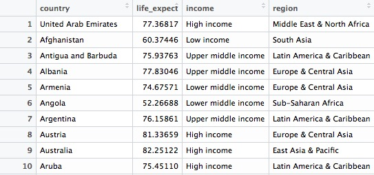

See what happens when you filter for `2015`. There should be no data returned, because `life_expect` data for 2015 hasn't yet been added to the World Bank's data portal.

If you are familiar with SQL, you will already have noticed that **dplyr** code, while similar, has an important difference. Rather than requiring clauses to be written in a certain order, starting with `SELECT`, the code is written in the order in which you perform operations. In that sense, it is much more logical than SQL. You simply decide what you want to do with the data, and proceed step-by-step.

##### Find the ten high-income countries with the lowest life expectancy in 2014

```r
# find the ten high-income countries with the lowest life expectancy
high_income_short_life <- longevity %>%
  filter(income == "High income") %>%
  arrange(life_expect) %>%
  head(10)
```
This code takes the previous filtered `longevity` object, filters it for countries in the high income group only, then sorts the data, using `arrange` (the default is ascending order). Finally it uses `head(10)` to return the first ten countries in the sorted data.

This should be the result:

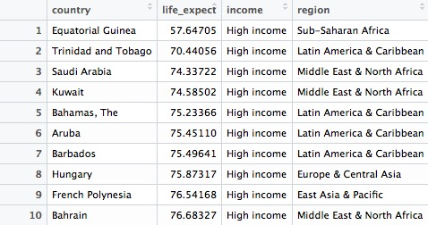

##### Find the 20 countries with the longest life expectancy in 2014, plus the United States with its rank, if it lies outside the top 20

```r
# find the 20 countries with the longest life expectancies, 
# plus the United States with its rank, if it lies outside the top 20
long_life <- longevity %>%
  arrange(desc(life_expect)) %>%
  mutate(rank = c(1:195)) %>%
  filter(rank <= 20 | country == "United States")
```
This should be the result, showing the United States to rank a lowly 42nd out of 195 countries:

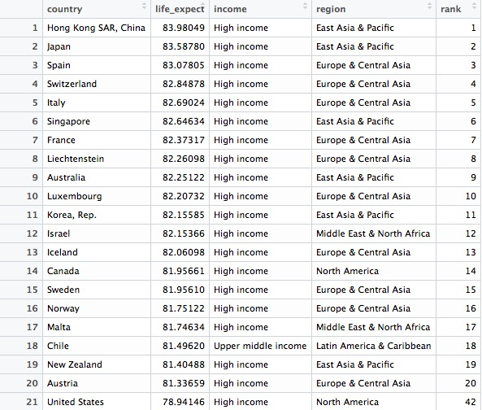

Hopefully the logic and flexibility of **dplyr** code is now becoming clear. Here we start by sorting the `longevity` data frame in descending order of life expantancy, then we create a new variable in the data called `rank`, using the `mutate` function. By feeding this a list of numbers from 1 to 195, we rank the countries according to their life expectancy. Finally we filter the data for the top 20 countries, plus the United States.

Whereas in the initial filter of the data to create `longevity` data frame we used `&` to return data meeting both criteria, this time we used `|` to include data meeting either criteria. `&` and `|` are equivalent to `AND` and `OR` in SQL. When combining `&` and `|` in more complex filters, use parentheses to determine which parts of the evaluation should be carried out first.

Notice also in this code that a single `=` is used to change or create values, while `==` is used to test whether a value is equal to something.


##### Now let's find out where Russia ranks, too
```r
# find the 20 countries with the longest life expectancies,
# plus the United States and Russia with their ranks
long_life <- longevity %>%
  arrange(desc(life_expect)) %>%
  mutate(rank = c(1:195)) %>%
  filter(rank <= 20 | grepl("United States|Russia", country))
```

This should be the result:

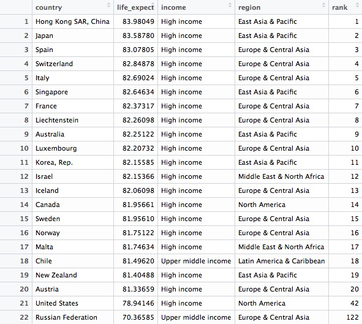

This codes demonstrates some simple pattern matching on text, using the function `grepl("pattern_a|pattern_b", x)`, which searches variable `x` for values containing any of a list of text values. This is useful for fuzzy text matching. Notice how searching for `Russia` returns `Russian Federation`, which is the country's full name.

#### Write data to a CSV file

**readr** can write data to CSV and other text files. This code will save the result above to a CSV file in your working directory:

```r
# write data to a csv file
write_csv(long_life, "long_life.csv" na="")
```
Although we have no null values here, including `na=""` is good practice, because it ensures that any empty cells in the data frame are saved as blanks, not `NA`.

#### Group and summarize data

```r
# summarize the data by year, finding the maximum and minimum country-level life expectancies, and then calculate the range of values
longevity_summary <- nations1 %>%
  filter(!is.na(life_expect)) %>%
  group_by(year) %>%
  summarize(countries = n(),
            max_life_expect = max(life_expect),
            min_life_expect = min(life_expect)) %>%
  mutate(range_life_expect = max_life_expect - min_life_expect) %>%
  arrange(desc(year))
```

This should be the result:

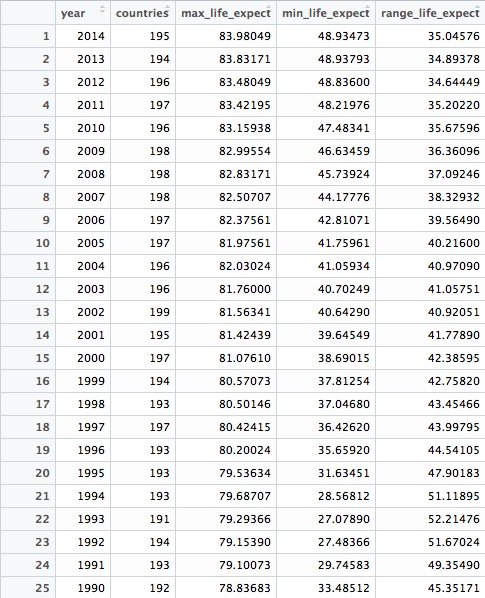

This code introduces the functions `group_by()` and `summarize()`. The former works like `GROUP BY` in SQL, but the separate `summarize()` function makes it much easier to think about how to summarize the data. In SQL, you would have to work on the initial `SELECT` clause to do this.

The entire `summarize()` function could be written on one line, but I have started a new line after each summary statistic for clarity.

In this example, we calculate the number of countries for which we have data in each year, then the maximum and minimum country-level life expectancies. Having done that, we use `mutate` function to calculate the range of values by subtracting the minimum from the maximum.

#### Join data from two data frames

There are also a number of **join** functions in **dplyr** to combine data from two data frames. Here are the most useful:

- `inner_join()` returns values from both tables only where there is a match.
- `left_join()` returns all the values from the first-mentioned table, plus those from the second table that match.
- `semi_join()` filters the first-mentioned table to include only values that have matches in the second table.
- `anti_join()` filters the first-mentioned table to include only values that have no matches in the second table.

[Here is a useful reference](http://stat545-ubc.github.io/bit001_dplyr-cheatsheet.html) for managing joins with **dplyr**.

This code will join `nations2` to `nations1`

```r
nations <- inner_join(nations1, nations2)
```

In this case, `left_join` and `right_join` would also produce the same result, as both data frames have records for every country and year.

By default, **dplyr** looks for variables with matching names, here `iso3c` and `year`, and joins on those. But you can also specify exactly how a join should be made, like this:

```r
nations <- inner_join(nations1, nations2, by = c("iso3c" = "iso3c", "year" = "year"))
```
##### Calculate total GDP by region and year

In the joined data frame, we can now calculate the total GDP for each country and each year, in trillions of dollars, and then add up the totals by region over the years:

```r
# total GDP, in trillions of dollars, by region, over time
gdp_regions <- nations %>%
  mutate(gdp = gdp_percap * population,
         gdp_tn = gdp/1000000000000) %>%
  group_by(region, year) %>%
  summarize(total_gdp_tn = sum(gdp_tn, na.rm = TRUE))
```
Here are the first few rows in the data that is returned:

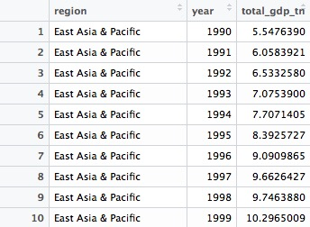

Notice that variables created within a `mutate` function can be immediately used within the same function.

Here the `group_by()` function groups on two variables, `region` and 	`year`.

Notice that the `sum` function used to add up the GDP values across countries within each region and year includes the argument `na.rm = TRUE`, to remove the `NA` values before running the calculation. See what happens if you don't include this. Previously this wasn't necessary because I had started by filtering out the `NA`s. 

Get into the habit of including `na.rm = TRUE` in your summary functions, to avoid problems cuased by null values!


### Now make some simple charts

#### Introducing ggplot2 and the grammar of graphics

The "gg" in **ggplot2** stands for "[grammar of graphics](http://www.amazon.com/The-Grammar-Graphics-Statistics-Computing/dp/0387245448)," an approach to drawing charts devised by the statistician Leland Wilkinson. Rather than thinking in terms of finished charts like a scatter plot or a column chart, it starts by defining the coordinate system (usually the X and Y axes), maps data onto those coordinates, and then adds layers such as points, bars and so on. This is the logic behind ggplot2 code.

#### **ggplot2** code basics:

- `ggplot` This is the master function that creates a **ggplot2** chart.
- `aes` This function, named for "aesthetic mapping," is used whenever data values are mapped onto a chart. So it is used when you define which variables are plotted onto the X and Y axes, and also if you want to change the size or color of parts of the chart according to values for a variable.
- `geom` All of the functions that add layers to a chart start with `geom`, followed by an underscore, for example `geom_point()` or `geom_bar()`. The code in the brackets for any `geom` layer styles the items in that layer, and can include `aes` mappings of values from data.
- `theme` This function modifies the appearance of elements of a plot. It is used, for example, to set size and font face for text, the position of a legend, and so on.
- `scale` Functions that begin with `scale`, followed by an underscore, are used to modify the way an `aes` mapping of data appears on a chart. They can change the axis range, for example, or specify a color palette to be used to encode values in the data.
- `+` is used each time you add a layer, a scale, a theme, or elements like axis labels and a title After a `+` you can continue on the same line of code or move the next line. I usually write a new line after each `+`, which makes the code easier to follow.

##### Draw a line chart showing total GDP, by region, over time.

```r
# Draw a line chart showing total GDP, by region, over time.
ggplot(gdp_regions, aes(x=year, y=total_gdp_tn, color=region)) +
  geom_line(size=1) +
  xlab("") +
  ylab("Total GDP ($ trillions)") +
  theme_minimal(base_size = 12)
```


This simple code draws a chart from the `gdp_regions` data, putting `year` on the X axis, and `total_gdp_tn` on the Y. It codes the regions by color, and then adds a line for each region to the chart using `geom_line()`. `xlab()` and `ylab` control the axis labels, which would otherwise by the variable names, and `theme_minimal` replaces the default gray grid of a **ggplot2** chart with a white background. `base_size` sets the default font size.

##### Draw a bar chart showing the ten high-income countries with the lowest life expectancies in 2014.

```r
ggplot(high_income_short_life, aes(x=reorder(country,-life_expect), y=life_expect)) +
  geom_bar(stat="identity", fill = "red", alpha = 0.7) +
  xlab("") +
  ylab("Life expectancy at birth (2014)") + 
  ggtitle("Rich countries with low life expectancies") +
  theme_minimal(base_size = 12) +
  theme(panel.grid.major.y = element_blank(),
        panel.grid.minor.y = element_blank()) +
  coord_flip()
```
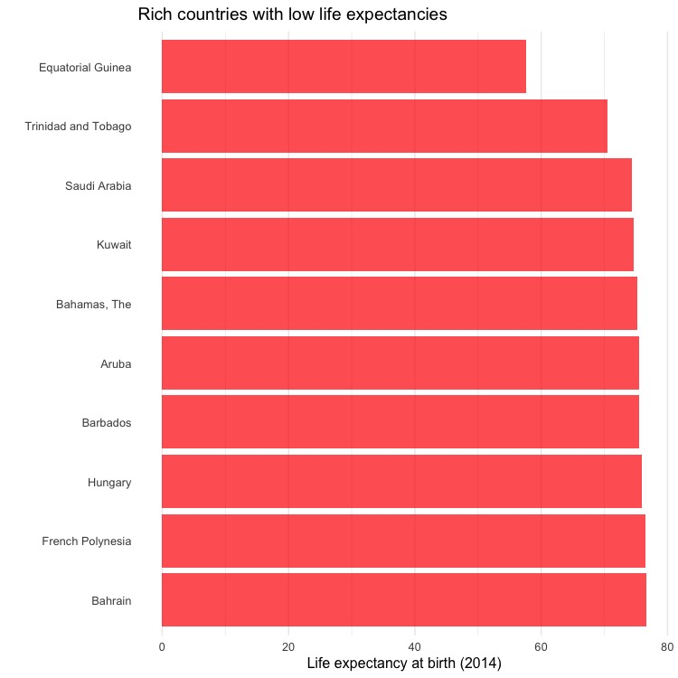

This is not terribly interesting, but it shows how a different `geom` creates a different type of chart. In `geom_bar`, `stat="identity"` ensures that the bars are drawn from the data mapped to the Y axis, rather than a count of the number of records. For solid objects like bars, `fill` sets the color of the object, which `color` controls the colour of their outline, if desired. `alpha` controls transparency; `ggtitle` adds a title, and the `theme()` function here removes grid lines on the axis with the coutries. Finally, `coord_flip` swaps the X and Y axes, turning a vertical column chart into a horizontal bar chart.

Notice also how `reorder()` is used to sort the bars by `life_expect`.

In this simpler code, the bars are not sorted by life expectancy:

```r
ggplot(high_income_short_life, aes(x=country, y=life_expect)) +
  geom_bar(stat="identity", fill = "red", alpha = 0.7) +
  xlab("") +
  ylab("Life expectancy at birth (2014)") + 
  ggtitle("Rich countries with low life expectancies") +
  theme_minimal(base_size = 12) +
  theme(panel.grid.major.y = element_blank(),
        panel.grid.minor.y = element_blank()) +
  coord_flip()
```
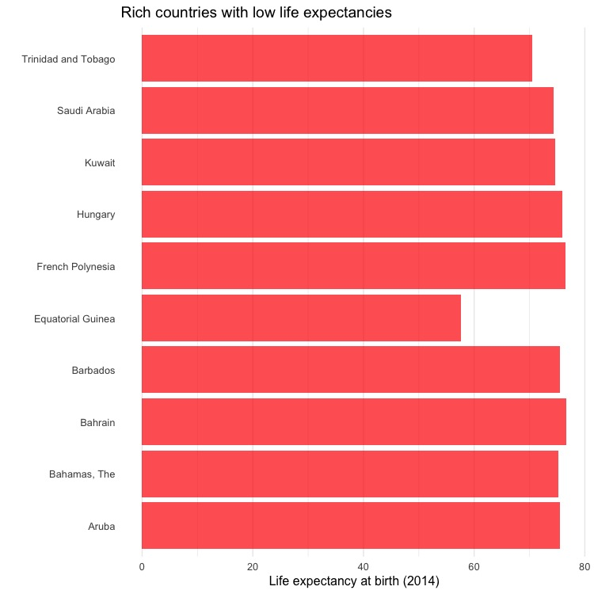

Save each chart using the `Export` menu in the `Plots` panel at bottom right, setting the dimensions and file type as desired.

### Load California kindergarten immunization data

Now we'll work with the California immunization data.

```r
# load data
immun <- read_csv("kindergarten.csv",  col_types = list(
  county = col_character(),
  district = col_character(),
  sch_code = col_character(),
  pub_priv = col_character(),
  school = col_character(),
  enrollment = col_integer(),
  complete  = col_integer(),
  start_year = col_integer()))

immun_2015 <- read_csv("kindergarten_2015.csv",  col_types = list(
  county = col_character(),
  district = col_character(),
  sch_code = col_character(),
  pub_priv = col_character(),
  school = col_character(),
  enrollment = col_integer(),
  complete  = col_integer(),
  start_year = col_integer()))
```

We need to append the data for 2015 to the older data. So this code specifies the data type for each variable, to be sure that there won't be any mismatches in data type that would cause an error in the next step.

#### Append the 2015 data to the older data

```r
# append the 2015 data to the older data
immun <- bind_rows(immun, immun_2015)
```

This code introduces`bind_rows()`, which appends one data frame to another, based on matching column names and data types. (If a column exists in one data frame but not in the other, `NA`s will be added where necessary.)

#### Calculate the percentage of children with incomplete immunizations, for the entire state, and by county

The data contains the number of children enrolled in each kindergarten across the state, and the number who has the complete recommended immunizations at the start of the year.

From this, we can calculate the percentage of children who did not have the complete achedule of immunizations. The following code runs these calculations for each year, first for the entire state, summing across all kindergartens grouped by year, and then for each of California's 58 counties, by changing the `group_by` function.

```r
# percentage incomplete, entire state, by year
immun_year <- immun %>%
  group_by(start_year) %>%
  summarize(enrolled = sum(enrollment, na.rm=TRUE),
            completed = sum(complete, na.rm=TRUE)) %>%
  mutate(pc_incomplete = round(((enrolled-completed)/enrolled*100),2))

# percentage incomplete, by county, by year
immun_counties_year <- immun %>%
  group_by(county,start_year) %>%
  summarize(enrolled = sum(enrollment, na.rm = TRUE),
            completed = sum(complete, na.rm = TRUE)) %>%
  mutate(pc_incomplete = round(((enrolled-completed)/enrolled*100),2))
```
Notice how the `round(x),n` function is used to round values for `x`, here the percentage incomplete calculation, to `n` decimal places, here 2. Using negative numbers for `n` will round to tens, hundreds, and so on.

Now we can identify the five largest counties with the largest enrollment over the years, and use a join to filter the data by counties for just these five:

```r
# identify five counties with the largest enrollment over all years
top5 <- immun %>%
  group_by(county) %>%
  summarize(enrolled = sum(enrollment, na.rm = TRUE)) %>%
  arrange(desc(enrolled)) %>%
  head(5) %>%
  select(county)

# proportion incomplete, top 5 counties by enrollment, by year
immun_top5_year <- semi_join(immun_counties_year, top5)
```
Notice the use of `semi_join()` to filter the data for just the five counties with the largest kindergarten enrollment.

#### Make a series of charts to analyze this summarized data

##### Column chart by year, entire state

```r
# column chart by year, entire state
ggplot(immun_year, aes(x = start_year, y = pc_incomplete)) + 
  geom_bar(stat = "identity", fill = "red", alpha = 0.7) +
  xlab("") +
  ylab("Percent incomplete") +
  ggtitle("Immunization in California kindergartens, entire state") + 
  theme_minimal(base_size = 12) +
  theme(panel.grid.major.x = element_blank(),
        panel.grid.minor.x = element_blank())
```

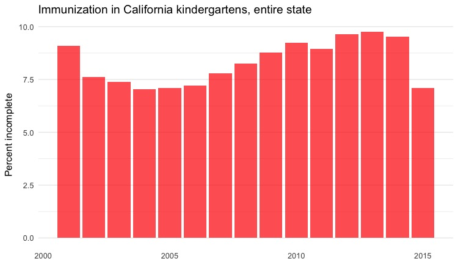

##### Dot-and-line chart by year, top 5 counties

```r
# dot and line chart by year, top5 counties
ggplot(immun_top5_year, aes(x = start_year, y = pc_incomplete, color = county)) + 
  geom_line(size = 1) +
  geom_point(size = 3) +
  xlab("") +
  ylab("Percent incomplete") +
  ggtitle("Immunization in California kindergartens\n(five largest counties)") +
  theme_minimal(base_size = 12)
```
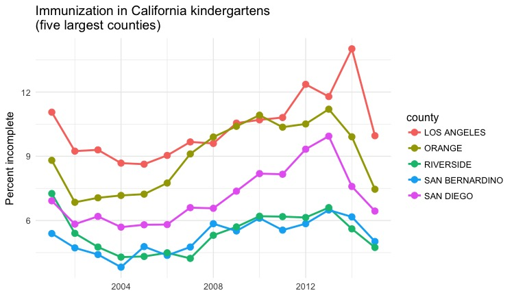

Notice that this chart has two data layers, `geom_point()` and `geom_line`. Notice also how `\n` can be used in text, here in the chart title, to insert a line break.

##### Heat map by year, all counties

```r
# heat map, all counties, by year
ggplot(immun_counties_year, aes(x = start_year, y = county)) +
  geom_tile(aes(fill = pc_incomplete), color = "white") +
  scale_fill_gradient(low = "white",
                      high = "red", 
                      name="") +
  xlab("") +
  ylab("County") +
  ggtitle("Immunization in California kindergartens, by county") +
  theme_minimal(base_size = 10) +
  theme(panel.grid.major = element_blank(),
        panel.grid.minor = element_blank(),
        legend.position="bottom",
        legend.key.height = unit(0.4, "cm"))
```

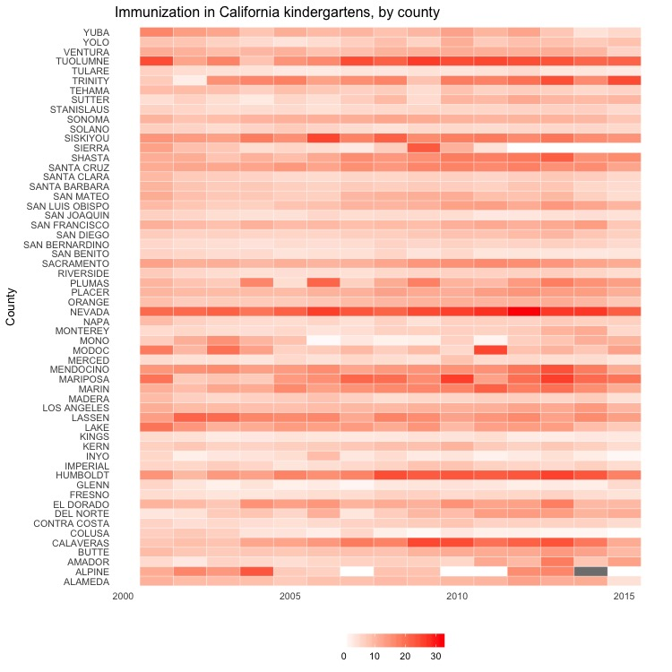

This code uses `geom_tile()` to create a heat map, and `scale_fill_gradient` to fill the tiles with color on a gradient from white to bright red, depending on the values in the data.

### Next steps

There is plently more that can be done with this data to practice with **dplyr** and **ggplot2**.

Some suggestions:

 - Calculate the total number of births and the total number of neonatal deaths from the rates in the `nations1` data, then analyze trends in total neonatal deaths by country and region over time.

 - Recreate a version of the late Hans Rosling's famous "health and wealth of nations" chart, by filtering the joined `nations` data for 2014 and drawing a bubble chart of GDP per capita against life expantancy, sizing the bubble for each country by population and coloring them by region.

 - Analyze the California immunization data within a single county by school district.


### Further reading

**[Introduction to dplyr](https://cran.rstudio.com/web/packages/dplyr/vignettes/introduction.html)**
From its creator, Hadley Wickham.

**[RStudio Data Wrangling Cheat Sheet](https://www.rstudio.com/wp-content/uploads/2015/02/data-wrangling-cheatsheet.pdf)**
Also introduces the **[tidyr](https://blog.rstudio.org/2014/07/22/introducing-tidyr/)** package, which can manage wide-to-long and long-to-wide transformations, among other data manipulations.

**[RStudio ggplot2 Cheat Sheet](https://www.rstudio.com/wp-content/uploads/2015/08/ggplot2-cheatsheet.pdf)** 
Another useful cheat sheet from RStudio.

**[Stack Overflow](http://stackoverflow.com/)**
For any work involving code, this question-and-answer site is a great resource for when you get stuck, to see how others have solved similar problems. Search the site, or [browse R questions](http://stackoverflow.com/questions/tagged/r)

**Winston Chang: [*R Graphics Cookbook*](http://www.amazon.com/R-Graphics-Cookbook-Winston-Chang/dp/1449316956)**
(Chang also has [a helpful website](http://www.cookbook-r.com/) with much of the same information, available for free.)

