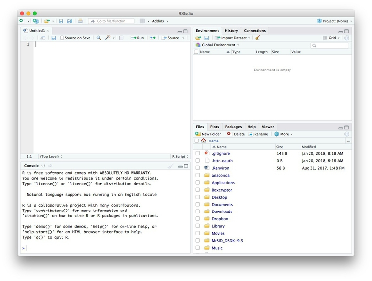
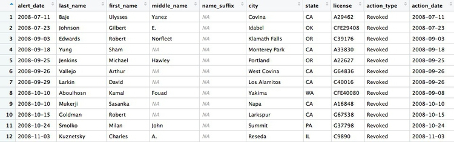
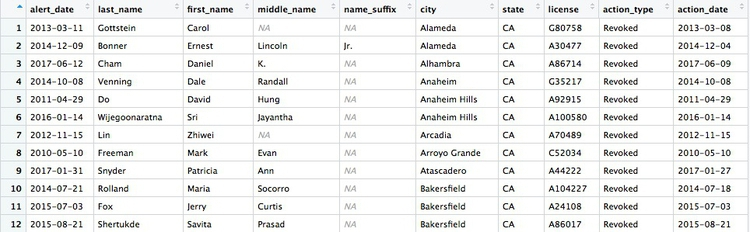
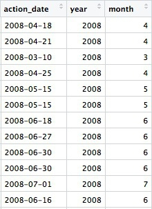
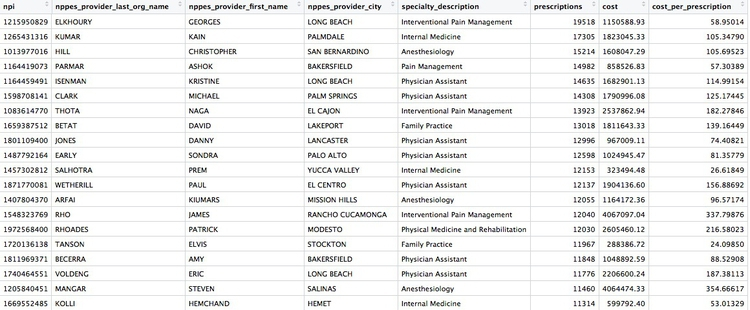
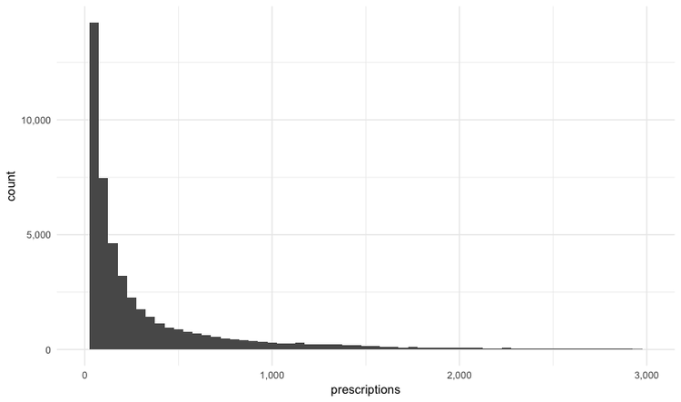
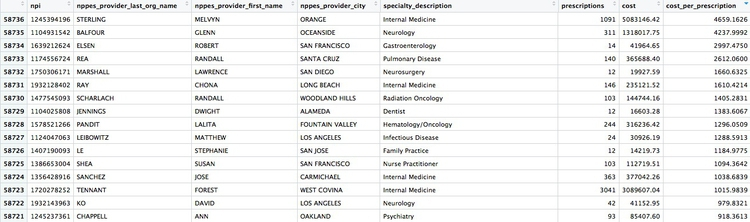
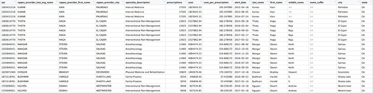

# R, RStudio, and the tidyverse for data analysis

### Introducing R and RStudio

In today's class we will work with **[R](http://www.r-project.org/)**, which is a very powerful tool, designed by statisticians for data analysis. Described on its website as "free software environment for statistical computing and graphics," R is a programming language that opens a world of possibilities for analyzing data. Indeed, just about anything you may want to do with data can be done with R, from web scraping, through statistical analysis and machine learning, to making interactive graphics.

There is much more material here than we will be able to cover in a short class, but these notes will remain available for you to work through later.

**[RStudio](https://www.rstudio.com/)** is an "integrated development environment," or IDE, for R that provides a user-friendly interface.

Launch RStudio, and the screen should look like this:


The main panel to the left is the R Console. Type valid R code into here, hit `return`, and it will be run.

### The data we will use

The data for this session should be loaded on the computers at NICAR. If you're following along remotely or on your own computer at the meeting, download from [here](data/r-analysis.zip), unzip the folder and place it on your desktop. It contains the following files:

- `ca_discipline.csv` Disciplinary alerts and actions issued by the Medical Board of California from 2008 to 2017. Processed from downloads available [here](http://www.mbc.ca.gov/Publications/Disciplinary_Actions/). Contains the following variables:

	- `alert_date` Date alert issued.
	- `last_name` Last name of doctor/health care provider.
	- `first_name` First name of doctor/health care provider.
	- `middle_name` Middle/other names.
	- `name_suffix` Name suffix (Jr., II etc)
	- `city` City of practive location.
	- `state` State of practice location.
	- `license` California medical license number.
	- `action_type` Type of action.
	- `action_date` Date of action.


- `ca_medicare_opioids.csv` Data on prescriptions of opioid drugs under the Medicare Part D Prescription Drug Program by doctors in California, from 2013 to 2015. Filtered from the national data downloads available [here](https://www.cms.gov/Research-Statistics-Data-and-Systems/Statistics-Trends-and-Reports/Medicare-Provider-Charge-Data/Part-D-Prescriber.html). It contains many variables, including:
  - `npi` [National Provider Identifier](https://npiregistry.cms.hhs.gov/) (NPI) for the doctor/organization making the claim. This is a unique code for each health care provider.
  - `nppes_provider_last_org_name` For individual doctors, their last name. For organizations, the organziation name.
  - `nppes_provider_first_name` First name for individual doctors, blank for organizations.
  - `nppes_provider_city` City where the provider is located.
  - `nppes_provider_state` State where the provider is located; "CA" for all of these records.
  - `specialty_description` Provider's medical speciality, reported on their medicare claims. For providers that have more than one Medicare specialty code reported on their claims, the code associated with the largest number of services.
  - `drug_name` Includes both brand names (drugs that have a trademarked name) and generic names (drugs that do not have a trademarked name).
  - `generic_name` The chemical ingredient of a drug rather than the trademarked brand name under which the drug is sold.
  - `bene_count` Total number of unique Medicare Part D beneficiaries (i.e. patients) with at least one claim for the drug. Counts fewer than 11 are suppressed and are indicated by a blank.
  - `total_claim_count` Number of Medicare Part D claims; includes original prescriptions and refills. If less than 11, counts are not included in the data file.
  - `total_drug_cost` Total cost paid for all associated claims; includes ingredient cost, dispensing fee, sales tax, and any applicable fees.
  - `year` 2013, 2014, or 2015.

- `npi_license.csv` Crosswalk file to join NPI identifiers to state license numbers, processed from the download available [here](http://www.nber.org/data/npi-state-license-crosswalk.html) to include license numbers potentially matching California doctors. This will provide one way of joining the precription data to the medical board disciplinary data. As we shall see, problems with the data mean that it is not infallible. Contains the following variables:
 - `npi` National Provider Identifier, as described above.
 - `plicnum` State license number, from the original file.
 - `license` Processed from `pclicnum` to conform to the format of California medical license numbers.

### Some words of caution, before we start

The US is currently in the grip of an epidemic of opioid abuse and addiction. Although [widespread medical prescription](https://www.buzzfeed.com/danvergano/2-old-painkiller-papers) of opioids [helped drive addiction](https://www.buzzfeed.com/danvergano/whats-causing-the-opioid-crisis), a [majority of overdoses](https://www.buzzfeed.com/danvergano/life-expectancy-opioid-overdoses) now occur through the consumption of drugs purchased illegally.

Opioids have important medical uses, and just because a doctor prescribes large amounts of the drugs doesn't necessarily mean they are practising irresponsibly.

As ProPublica explained, in [the methods](https://www.propublica.org/article/how-we-analyzed-medicares-drug-data-long-methodology) for its stories based on Medicare Part D prescription data:

> The data could not tell us everything. We interviewed many high-volume prescribers to better understand their patients and their practices. Some told us their numbers were high because they were credited with prescriptions by others working in the same practice. In addition, providers who primarily work in long-term care facilities or busy clinics with many patients naturally may write more prescriptions.


### Reproducibility: Save your scripts

Data journalism should ideally be fully documented and reproducible. R makes this easy, as every operation performed can be saved in a script, and repeated by running that script. Click on the  icon at top left and select `R Script`. A new panel should now open:



Any code we type in here can be run in the console. Hitting `Run` will run the line of code on which the cursor is sitting. To run multiple lines of code, highlight them and click `Run`.

Click on the save/disk icon in the script panel and save the blank script to the file on your desktop with the data for this week, calling it `r-analysis.R`.

### Set your working directory

Now we can set the working directory to this folder by selecting from the top menu `Session>Set Working Directory>To Source File Location`. (Doing so means we can load the files in this directory without having to refer to the full path for their location, and anything we save will be written to this folder.)

Notice how this code appears in the console (the exact code will depend upon the location of the script and data on your computer:

```R
setwd("~/Desktop/r-analysis")
```

### Save your data

The panel at top right has three tabs, the first showing the `Environment`, or all of the "objects" loaded into memory for this R session. Save this as well, and you won't have to load and process all of the data again if you return to return to a project later.

Click on the save/disk icon in the `Environment` panel to save the file as `week5.RData`. The following code should appear in the Console:

```r
save.image("~/Desktop/r-analysis/r-analysis.RData")
```
Copy this code into your script, placing it at the end, with a comment, explaining what it does:

```r
# save session data
save.image("~/Desktop/r-analysis/r-analysis.RData")
```
Now if you run your entire script, the last action will always be to save the data in your environment.

### Comment your code

Anything that appears on a line after `#` will be treated as a comment, and will be ignored when the code is run. You can use this to explain what the code does. Get into the habit of commenting your code: Don't trust yourself to remember!

### Some R code basics

- `<-` is known as an “assignment operator.” It means: “Make the object named to the left equal to the output of the code to the right.”
- `&` means AND, in Boolean logic.
- `|` means OR, in Boolean logic.
- `!` means NOT, in Boolean logic.
- When referring to values entered as text, or to dates, put them in quote marks, like this: `"United States"`, or `"2016-07-26"`. Numbers are not quoted.
- When entering two or more values as a list, combine them using the function `c`, for combine, with the values separated by commas, for example: `c("2017-07-26","2017-08-04")`
- As in a spreadsheet, you can specify a range of values with a colon, for example: `c(1:10)` creates a list of integers (whole numbers) from one to ten.
- Some common operators:
 - `+` `-` add, subtract.
 -  `*` `/` multiply, divide.
 -  `>` `<` greater than, less than.
 -  `>=` `<=` greater than or equal to, less than or equal to.
 -  `!=` not equal to.

- Equals signs can be a little confusing, but see how they are used in the code we use today:

 -  `==` test whether an object is equal to a value. This is often used when filtering data, as we will see.
 -  `=` make an object equal to a value; similar to `<-`, but used within a function (see below).

- Handling null values:
 - Nulls are designated as `NA`.
 - `is.na(x)` looks for nulls within variable `x`.
 - `!is.na(x)` looks for non-null values within variable `x`.

Here, `is.na` is a **function**. Functions are followed by parentheses, and act on the data/code in the parentheses.

**Important:** Object and variable names in R should not contain spaces.

### Introducing R packages and the tidyverse

Much of the power of R comes from the thousands of "packages" written by its community of open source contributors. These are optimized for specific statistical, graphical or data-processing tasks. To see what packages are available in the basic distribution of R, select the `Packages` tab in the panel at bottom right. To find packages for particular tasks, try searching Google using appropriate keywords and the phrase "R package."

Our goal for today's class is to get used to processing and analyzing data using a powerful series of R packages known as the  **[tidyverse](https://blog.rstudio.org/2016/09/15/tidyverse-1-0-0/)**.

The tidyverse was pioneered by [Hadley Wickham](http://hadley.nz/), chief scientist at RStudio, but now has many contributors.

Today, we will use the following tidyverse packages:

- **[readr](http://readr.tidyverse.org/)** Reads and writes CSV and other text files.
- **[dplyr](http://dplyr.tidyverse.org/)** Processes and analyzes data, using the operations we discussed in the first class.
- **[lubridate](http://lubridate.tidyverse.org/)** Makes working with dates and times much easier.
- **[ggplot2](http://ggplot2.tidyverse.org/)** For making charts.

The tidyverse packages should already be installed on the computers at NICAR.

To install a package, click on the `Install` icon in the `Packages` tab, type its name into the dialog box, and make sure that `Install dependencies` is checked, as some packages will only run correctly if other packages are also installed.  The tidyverse packages can be installed in one go. Click `Install` and all of the required packages should install:


Notice that the following code appears in the console:

```r
install.packages("tidyverse")
```
So you can also install packages with code in this format, without using the point-and-click interface.

Each time you start R, it's a good idea to click on `Update` in the `Packages` panel to update all your installed packages to the latest versions.

Installing a package makes it available to you, but to use it in any R session you need to load it. You can do this by checking its box in the `Packages` panel. However, we will enter the following code into our script, then highlight these lines of code and run them:

```r
# load packages to read and write csv files, process data, and work with dates
library(readr)
library(dplyr)
library(lubridate)
```

At this point, and at regular intervals, save your script, by clicking the save/disk icon in the script panel, or using the `⌘-S`/`Ctrl-S` keyboard shortcut.

### Load and view data

#### Load data

You can load data into the current R session by selecting `Import Dataset>From Text File...` in the `Environment` tab.

However, we will use the `read_csv` function from the **readr** package. Copy the following code into your script and `Run`:

```r
# load ca medical board disciplinary actions data
ca_discipline <- read_csv("ca_discipline.csv")
```
Notice that the `Environment` now contains an objects of the type `tbl_df`, a variety of the standard R object for holding tables of data, known as a **data frame**:


#### Examine the data

We can `View` data at any time by clicking on its table icon in the `Environment` tab in the `Grid` view. The following code has the same effect:

```r
View(ca_discipline)
```

The `glimpse` function from **dplyr** will tell you more about the variables in your data, including their data type. Copy this code into your script and `Run`:

```r
# view structure of data
glimpse(ca_discipline)
```
This should give the following output in the R Console:

```JSON
Variables: 10
$ alert_date  <date> 2008-04-18, 2008-04-21, 2008-04-23, 2008-04-28, 2008-05-15, 2008-05-15, 2008-06-18, 2008-06-27, 2008...
$ last_name   <chr> "Boyajian", "Cragen", "Chow", "Gravich", "Kabacy", "Aboulhosn", "Harron", "Fitzpatrick", "Adrian", "M...
$ first_name  <chr> "John", "Richard", "Hubert", "Anna", "George", "Kamal", "Raymond", "Christian", "Adrian", "Pamela", "...
$ middle_name <chr> "Arthur", "Darin", "Wing", NA, "E.", "Fouad", "A.", "John", NA, "J.", "Quoc", "M.", "Elisabet", NA, "...
$ name_suffix <chr> NA, NA, NA, NA, NA, NA, NA, NA, NA, NA, NA, NA, NA, NA, NA, NA, NA, NA, NA, NA, NA, NA, NA, NA, NA, N...
$ city        <chr> "Boise", "Temecula", "San Gabriel", "Los Angeles", "Lacey", "Yakima", "Bridgeport", "Las Vegas", "Las...
$ state       <chr> "ID", "CA", "CA", "CA", "WA", "WA", "WV", "NM", "NV", "CA", "CA", "CA", "CA", "CA", "CA", "TN", "CA",...
$ license     <chr> "A25855", "A54872", "G45435", "A40805", "G13766", "CFE40080", "G8415", "G47520", "AFE56237", "G85601"...
$ action_type <chr> "Surrendered", "Surrendered", "Superior Court Order/Restrictions", "Superior Court Order/Restrictions...
$ action_date <date> 2008-04-18, 2008-04-21, 2008-03-10, 2008-04-25, 2008-05-15, 2008-05-15, 2008-06-18, 2008-06-27, 2008...
```

`chr` means "character," or a string of text (which can also be treated as a categorical variable); `date` means a date. While we don't have these data types here, `int` means an integer, or whole number; `dbl` means a number that may include decimal fractions; and `POSIXct` means a full date and timestamp.

If you run into any trouble importing data with **readr**, you may need to specify the data types for some columns -- in particular for date and time. [This link](https://github.com/hadley/readr/blob/master/vignettes/column-types.Rmd) explains how to set data types for individual variables when importing data with **readr**.

To specify an individual column use the name of the data frame and the column name, separated by `$`. Type this into your script and run:

```r
# print values for alert_date in the ca_discipline data
print(ca_discipline$alert_date)
```
The output will be the first 1,000 values for that variable.

If you need to change the data type for any variable, use the following functions:

- `as.character` converts to a text string.
- `as.numeric` converts to a number that may include decimal fractions (`dbl`).
- `as.factor` converts to a categorical variable.
- `as.integer` converts to an integer
- `as.Date` converts to a date
- `as.POSIXct` converts to a full date and timestamp.

So this code will convert `alert_date` codes to text:

```r
# convert alert_date to text
ca_discipline$alert_date <- as.character(ca_discipline$alert_date)
glimpse(ca_discipline)
```
Notice that the data type for `alert_date` has now changed:

```JSON
Observations: 7,561
Variables: 10
$ alert_date  <chr> "2008-04-18", "2008-04-21", "2008-04-23", "2008-04-28", "2008-05-15", "2008-05-15", "2008-06-18", "20...
$ last_name   <chr> "Boyajian", "Cragen", "Chow", "Gravich", "Kabacy", "Aboulhosn", "Harron", "Fitzpatrick", "Adrian", "M...
$ first_name  <chr> "John", "Richard", "Hubert", "Anna", "George", "Kamal", "Raymond", "Christian", "Adrian", "Pamela", "...
$ middle_name <chr> "Arthur", "Darin", "Wing", NA, "E.", "Fouad", "A.", "John", NA, "J.", "Quoc", "M.", "Elisabet", NA, "...
$ name_suffix <chr> NA, NA, NA, NA, NA, NA, NA, NA, NA, NA, NA, NA, NA, NA, NA, NA, NA, NA, NA, NA, NA, NA, NA, NA, NA, N...
$ city        <chr> "Boise", "Temecula", "San Gabriel", "Los Angeles", "Lacey", "Yakima", "Bridgeport", "Las Vegas", "Las...
$ state       <chr> "ID", "CA", "CA", "CA", "WA", "WA", "WV", "NM", "NV", "CA", "CA", "CA", "CA", "CA", "CA", "TN", "CA",...
$ license     <chr> "A25855", "A54872", "G45435", "A40805", "G13766", "CFE40080", "G8415", "G47520", "AFE56237", "G85601"...
$ action_type <chr> "Surrendered", "Surrendered", "Superior Court Order/Restrictions", "Superior Court Order/Restrictions...
$ action_date <date> 2008-04-18, 2008-04-21, 2008-03-10, 2008-04-25, 2008-05-15, 2008-05-15, 2008-06-18, 2008-06-27, 2008...
```

### Process and analyze data with dplyr

We can use **dplyr** to process the data, using these basic operations with data:

- **Sort:** Largest to smallest, oldest to newest, alphabetical etc.

- **Filter:** Select a defined subset of the data.

- **Summarize/Aggregate:** Deriving one value from a series of other values to produce a summary statistic. Examples include: count, sum, mean, median, maximum, minimum etc. Often you'll **group** data into categories first, and then aggregate by group.

- **Join:** Merging entries from two or more datasets based on common field(s), e.g. unique ID number, last name and first name.

Here are some of the most useful functions in **dplyr**:

- `select` Choose which columns to include.
- `filter` **Filter** the data.
- `arrange` **Sort** the data, by size for continuous variables, by date, or alphabetically.
- `group_by` **Group** the data by a categorical variable.
- `summarize` **Summarize**, or aggregate (for each group if following `group_by`). Often used in conjunction with functions including:
	- `mean(x)` Calculate the mean, or average, for variable `x`.
	- `median(x)` Calculate the median.
	- `max(x)` Find the maximum value.
	- `min(x)` Find the minimum value.
	- `sum(x)` Add all the values together.
	- `n()` Count the number of records. Here there isn't a variable in the brackets of the function, because the number of records applies to all variables.
	- `n_distinct(x`) Count the number of unique values in variable `x`.
- `mutate` Create new column(s) in the data, or change existing column(s).
- `rename` Rename column(s).
- `bind_rows` Merge two data frames into one, combining data from columns with the same name.

There are also various functions to **join** data, which we will explore later.

These functions can be chained together using the "pipe" operator `%>%`, which makes the output of one line of code the input for the next. This allows you to run through a series of operations in a logical order. I find it helpful to think of `%>%` as meaning "then."

Now we will use **dplyr** to turn the `alert_date` variable back to dates:

```R
# convert alert_date to date using dplyr
ca_discipline <- ca_discipline %>%
  mutate(alert_date = as.Date(alert_date))
```
This code copies the `ca_discipline` data frame, and then (`%>%`) uses **dplyr**'s `mutate` function to change the data type for the `alert_date` variable. Because the copied data frame has the same name, it overwrites the original version.

#### Filter and sort data

To get used to working with **dplyr**, we will now start filtering and sorting the data according to the doctors' locations, and the types of disciplinary actions they faced.

First, let's look at the types of disciplinary actions in the data:

```R
# look at types of disciplinary actions
types <- ca_discipline %>%
  select(action_type) %>%
  unique()
```
This code first copies the `ca_disciplinary` data frame into a new object called `types`. Then (`%>%`) it `select`s the `action_type` variable only. Finally, it uses a function called `unique` to display the unique values in that variable, with no duplicates.

The new data frame has one column and 75 rows. If you `View`, the first few rows should look like this:


Many of the values for `action_types` seem to be subtle variations of the same thing. If we were going to all analyze the types in detail, we may need to group some of these together, after speaking to an expert to understand what they all mean. But some of the action types are clear and unambiguous: `Revoked` is the medical board's most severe sanction, which cancels a doctor's license to practise. So let's first **filter** the data to look at those actions:

```R
# filter for license revocations only
revoked <- ca_discipline %>%
  filter(action_type == "Revoked")
```
This code copies the `ca_discipline` data into a new data frame called `revoked` and then (`%>%`) uses the `filter` function to include only actions in which a doctor's license was revoked. Notice the use of `==` to test whether `action_type` is `Revoked`.

There should be 446 rows in the filtered data, and the first few should look like this:



Some of the doctors are not actually based in California. Doctors can be licensed to practise in more than one state, and the Medical Board of California typically issues its own sanction if a doctor is disciplined in their home state. So let's now **filter** the data to look only at doctors with revoked licenses who were based in California, and **sort** them by city.

```R
# filter for license revocations by doctors based in California, and sort by city
revoked_ca <- ca_discipline %>%
  filter(action_type == "Revoked"
         & state == "CA") %>%
  arrange(city)
```
Here, the `filter` combines two conditions with `&`. That means that both have to be met for the data to be included. Then `arrange` **sorts** the data, which for a text variable will be in alphabetical order. If you wanted to sort in reverse alphabetical order, the code would be: `(arrange(desc(city))`.

There should be 274 rows in the filtered data, and the first few should look like this:



Now let's **filter** for doctors based in Berkeley or Oakland who have had their licenses revoked:

```R
# doctors in Berkeley or Oakland who have had their licenses revoked 
revoked_oak_berk <- ca_discipline %>%
  filter(action_type == "Revoked"
       & (city == "Oakland" | city == "Berkeley"))
```

There should be just two doctors:


This code uses `|` to look for doctors in either Oakland **or** Berkeley. That part of the `filter` function is wrapped in parantheses to ensure that it is carried out first.

See what happens if you remove those parentheses, and work out why the result has changed. We will discuss this in class.

#### Append data using `bind_rows`

To demonstrate the `bind_rows` function, we will **filter** for doctors with revoked licenses in each of the two cities separately, and then append one data frame to the other.

```R
# doctors in Berkeley who had their licenses revoked
revoked_berk <- ca_discipline %>%
  filter(action_type == "Revoked"
       & city == "Berkeley")

# doctors in Oakland who had their licenses revoked
revoked_oak <- ca_discipline %>%
  filter(action_type == "Revoked"
       & city == "Oakland")

# doctors in Berkeley or Oakland who have had their licenses revoked
revoked_oak_berk <- bind_rows(revoked_oak, revoked_berk)
```

#### Write data to a CSV file

The **readr** package can also be used to write data from your environment into a CSV file:

```R
# write data to CSV file
write_csv(revoked_oak_berk, "revoked_oak_berk.csv", na = "")
```

The code `na = ""` ensures that null values in the data are written as blank cells; otherwise they would contain the letters `NA`.

#### Group and summarize data

Next we will **group** and **summarize** data by counting disciplinary actions by year and by month. But before doing that, we need to use the **lubridate** package to extract the year and month from `action_date`.

```R
# extract year and month from action_date
ca_discipline <- ca_discipline %>%
  mutate(year = year(action_date),
         month = month(action_date))
```

Now we have two extra columns in the data, giving the year and the month as a number:




The `year` and `month` functions are from the **lubridate** package. 

Previously we used the **dplyr** `mutate` function to modify an existing variable. Here we used it to create new variables. You can create or modify multiple variables in the same `mutate` function, separating each one by commas. Notice the use of `=` to make a variable equal to the output of code, within the `mutate` function.

Now we can calculate the number of license revocations for doctors based in California by year:

```R
# license revokations for doctors based in California, by year
revoked_ca_year <- ca_discipline %>%
  filter(action_type == "Revoked" 
         & state == "CA") %>%
  group_by(year) %>%
  summarize(revocations = n())
```

This should be the result:


The code first **filters** the data, as before, then **groups** by the new variable `year` using `group_by`, then **summarizes** by counting the number of records for each year using `summarize`. The last function creates a new variable called `revocations` from `n()`, which is a count of the rows in the data for each year.

Looking at this result and the raw `ca_discipline` data, we only have partial data for 2008. So if we want to count the number of license revocations by month over all the years, we should first **filter** out the data for 2008, which will otherwise skew the result.

```R
# license revokations for doctors based in California, by month
revoked_ca_month <- ca_discipline %>%
  filter(action_type == "Revoked" 
         & state == "CA"
         & year >= 2009) %>%
  group_by(month) %>%
  summarize(revocations = n())
```

This should be the result:


Notice how we used `>=` to filter for data where the year was 2009 or greater. The following code will achieve the same result:

```R
# license revokations for doctors based in California, by month
revoked_ca_month <- ca_discipline %>%
  filter(action_type == "Revoked" 
         & state == "CA"
         & year != 2008) %>%
  group_by(month) %>%
  summarize(revocations = n())
```

We can **group** and **summarize** by more than one variable at a time. The following code counts the number of actions of all types, by month and year. Again, we will first **filter** out the incomplete data for 2008.

```R
# disciplinary actions for doctors in California by year and month, from 2009 to 2017
actions_year_month <- ca_discipline %>%
  filter(state == "CA"
         & year >= 2009) %>%
  group_by(year, month) %>%
  summarize(actions = n()) %>%
  arrange(year, month)
```
The first few rows should look like this:


Notice that both the `group_by` and `arrange` functions **group** and **sort** the data, respectively, by two variables, separated by commas.

Now we will work with the larger data on doctors in California prescribing opioids under Medicare Part D, learn how to **join** data in different data frames, and see how to make some simple charts to help make sense of your data.

Load and view the data:

```R
# load opioid prescription data
ca_opioids <- read_csv("ca_medicare_opioids.csv")

# look at the data
View(ca_opioids)
```

#### Create a summary, showing the number of opioid prescriptions written by each doctor, the total cost of the opioids prescribed, and the cost per claim

```R
# Create a summary, showing the number of opioid prescriptions written by each provider, the total cost of the opioids prescribed, and the cost per claim
provider_summary <- ca_opioids %>% 
  group_by(npi,
           nppes_provider_last_org_name,
           nppes_provider_first_name,
           nppes_provider_city,
           specialty_description) %>%
  summarize(prescriptions = sum(total_claim_count),
            cost = sum(total_drug_cost)) %>%
  mutate(cost_per_prescription = cost/prescriptions) %>%
  arrange(desc(prescriptions))
```

There should be 58,736 rows in the data, and the top few should look like this:



When summarizing data, any `NA` values will cause the summary to be calculated as `NA`, unless you specify that nulls should be removed. If any of the cost or prescription values had been missing, for example, the summarize function would have to be written like this:

```R
 summarize(prescriptions = sum(total_claim_count, na.rm = TRUE),
            cost = sum(total_drug_cost, na.rm = TRUE))
```

### Draw some charts from this summary data

While running data analyses, it's often useful to create charts to look at summaries of the data. Particularly useful are histograms, to examine a distribution, and scatterplots, to see how one variable varies with another.

To make simple charts, we will use **ggplot2**.

#### Introducing ggplot2 and the grammar of graphics

The "gg" in **ggplot2** stands for "[grammar of graphics](http://www.amazon.com/The-Grammar-Graphics-Statistics-Computing/dp/0387245448)," an approach to drawing charts devised by the statistician Leland Wilkinson. Rather than thinking in terms of finished charts like a scatter plot or a column chart, it starts by defining the coordinate system (usually the X and Y axes), maps data onto those coordinates, and then adds layers such as points, bars and so on. This is the logic behind ggplot2 code.

Some key things to understand about **ggplot2**:

- `ggplot` This is the master function that creates a **ggplot2** chart.
- `aes` This function, named for "aesthetic mapping," is used whenever data values are mapped onto a chart. So it is used when you define which variables are plotted onto the X and Y axes, and also if you want to change the size or color of parts of the chart according to values for a variable.
- `geom` All of the functions that add layers to a chart start with `geom`, followed by an underscore, for example `geom_point` or `geom_bar`. The code in the parentheses for any `geom` layer styles the items in that layer, and can include `aes` mappings of values from data.
- `theme` This function modifies the appearance of elements of a plot, used, for example, to set size and font face for text, the position of a legend, and so on.
- `scale` Functions that begin with `scale`, followed by an underscore, are used to modify the way an `aes` mapping of data appears on a chart. They can change the axis range, for example, or specify a color palette to be used to encode values in the data.
- `+` is used each time you add a layer, a scale, a theme, or elements like axis labels and a title. After a `+` you can continue on the same line of code or move the next line. I usually write a new line after each `+`, which makes the code easier to follow.

#### Make a histogram of the prescriptions data

First load **ggplot2** and the **[scales](https://cran.r-project.org/web/packages/scales/scales.pdf)** package, which allows numbers to be displayed as currency, with thousands separated by commas, and so on.

```R
library(ggplot2)
library(scales)

```
It's always a good idea to look at the distribution of any quantitative variable.

```R
# histogram of the costs data
ggplot(provider_summary, aes(x = prescriptions)) +
  geom_histogram()
```
This code first stated that the `doctor_summary` data would be used for the chart in the `ggplot` function, then specificied that values for the number of prescriptions should be mapped to the X, or horizontal axis. We didn't need to specify a variable for the Y axis for a histogram, because that is automatically a count of the number of records (here the number of doctors) in each bin.

This should be the result:


The following code customizes the width of the bins, to 50 prescriptions, changes the X axis range between 0 and 3,000, and uses `labels` from the **scales** package to plot numbers with comma separators for thousands. `theme_minimal` is one of the built-in themes in **ggplot2**, which gives a basic chart with grid lines on a white background.

```R
ggplot(provider_summary, aes(x = prescriptions)) +
  geom_histogram(binwidth = 50) +
  theme_minimal() +
  scale_x_continuous(limits = c(0,3000),
                     labels = comma) +
  scale_y_continuous(labels = comma)
```



This is a very skewed distribution. Viewing this, we would conclude that the mean would not be a good summary statistic for this data; if we want to compare any doctor's prescriptions of opioids to that for a "typical" doctor, it would be better to compare to the median number of prescriptions.

#### Make a scatterplot of prescriptions and costs data

Scatterplots are good for seeing how one variable relates to one another, and also for spotting outliers in data. Here we would expect the total cost of the drugs prescribed to increase with the total number of prescriptions. A scatterplot allows us to see whether all the doctors are closely clustered around the trend line, or whether there are some interesting outliers.

```R
#### Make a scatterplot of prescriptions and costs data
ggplot(provider_summary, aes(x = prescriptions, y = cost)) +
  geom_point(alpha = 0.3) +
  geom_smooth(method = lm) +
  theme_minimal() +
  scale_x_continuous(labels = comma) +
  scale_y_continuous(labels = dollar)
```
In this code, we mapped the number of `prescriptions` to the X axis and their total `cost` to the Y or vertical axis. We then used `geom_point` to add the points, and made them partially transparent using `alpha = 0.3` (0 would be completely transparent; 1 would be completely opaque). `geom_smooth` added a trend line through the data; `method = lm` ensured that this is fitted with a "linear model," giving a straight line. `labels = dollar` formatted the Y axis so the numbers were shown in dollars.

This should be the result:


We can look sort the data in `View` to take a look at the doctors with unusually large costs per prescriptions:



Remember the words of caution: There may be some story leads here, but we would have to find out more about each doctor's practise and patients to determine whether their high costs per prescription are justified.

### Join data to find doctors who prescribed opioids who have also been subject to disciplinary actions.

There are a number of **join** functions in **dplyr** to combine data from two data frames. Here are the most useful:

- `inner_join` returns values from both tables only where there is a match.
- `left_join` returns all the values from the first-mentioned table, plus those from the second table that match.
- `semi_join` filters the first-mentioned table to include only values that have matches in the second table.
- `anti_join` filters the first-mentioned table to include only values that have no matches in the second table.

[Here is a useful reference](http://stat545-ubc.github.io/bit001_dplyr-cheatsheet.html) for managing joins with **dplyr**.

We will join the `provider_summary` data to the disciplinary actions data to see which of the doctors prescribing opioids have been in trouble with the Medical Board of California. The unique identifier in the prescriber data is their National Provider Identifier, whereas the unique identifier in the disciplinary data are the doctors' California medical license numbers. So we also need to load the file `npi_license.csv`, which relates these two identifiers to one another.

```R
# load data
npi_license <- read_csv("npi_license.csv")
```

First we will join these two files to one another:

```R
# join those two data frames
ca_discipline_npi <- left_join(ca_discipline, npi_license)
```

By default, **dplyr** will join by any variables with matching names, but you can also specify the variables on which to join. So this will achieve the same result:

```R
# join those two data frames
ca_discipline_npi <- left_join(ca_discipline, npi_license, by = "license")
```

If we `View` the result, the first few rows reveal some of the limitations of the `npi_license` data. Some of the doctors have not been joined to an `npi` code, while others appear to have more than one `npi` code (this is why there are 9,680 rows in the joined data, and only 7,651 in the `ca_discipline` data).


Having made this join, we can now join to the `provider_summary` data:

```R
# join disciplinary action data to the opioid prescription data
provider_summary_actions <- inner_join(provider_summary, ca_discipline_npi, by = "npi") %>%
  arrange(desc(prescriptions))
```

Here are the first few rows in the data:



Individual doctors may appear multiple times in the data if they have more than one disciplinary action on their file, because a join will be made to each individual action.

We can search for the disciplinary records and look at public documents at [this site](https://www.breeze.ca.gov/).

The second doctor on our list, Naga Thota, surrendered his California medical license on March 22, 2017. [This public document](http://www2.mbc.ca.gov/BreezePDL/document.aspx?path=%5cDIDOCS%5c20170315%5cDMRAAAFC8%5c&did=AAAFC170315180454982.DID) reveals that he was charged with prescribing excessive quantities of opioids to an addicted patient with whom he also engaged in a sexual relationship. In addition to disciplinary action from the Medical Board of California, he faced a criminal investigation by the federal Drug Enforcement Adminstration. In March 2017 [sentenced to two years](http://www.sandiegouniontribune.com/news/courts/sd-me-thota-sentencing-20170306-story.html), he was sentenced to two years in a federal prison.

The prescriptions data reveal that, prior to his conviction and the loss of his medical license, Thota was also one of the largest prescribers of opioids in the state of California.

There are likely to be other story leads from this join, which you could follow up through public records and other reporting.

We've already seen that the `npi_license` data has some limitations. Another (less reliable) way to join the data would be by using the doctors' first names, last names, and cities. First, however, we need to convert those variables in the `ca_discipline_npi` data to upper case, so they match the format of the `ca_opioids` data.

```R
# change case of variables to be used in the join
ca_discipline_npi <- ca_discipline_npi %>%
  mutate(last_name = toupper(last_name),
         first_name = toupper(first_name),
         city = toupper(city))

# join disciplinary action data to the opioid prescription data
provider_summary_actions_2 <- inner_join(provider_summary, ca_discipline_npi, by = c("nppes_provider_last_org_name" = "last_name", 
                                                                                 "nppes_provider_first_name" = "first_name",
                                                                                 "nppes_provider_city" = "city")) %>%
  arrange(desc(prescriptions))
```

Notice how the code is written to define the variables to be used for a custom join.

Now we can use an `anti_join` to see if this join picked up any doctors who were missing from the first.

```R
# join disciplinary action data to the opioid prescription data
provider_summary_actions_extra <- anti_join(provider_summary_actions_2, provider_summary_actions)
```

Here are the first few rows in that data:


Whenever making an join in this way, it crucial to verify through further reporting that the individuals matched are the same person. For example, there are several doctors called Peter Lee in Los Angeles. The one with the disciplinary record is [Peter Geon Lee](https://search.dca.ca.gov/details/8002/G/84673/aebacf63f2746d6ce6ac729ebbbe54f5), a plastic surgeon. This is not [Peter Chong Lee](https://search.dca.ca.gov/details/8002/A/47846/e516806f7ff2db771d5b14b7d175c755), the physical medicine and rehabilitation specialist, with the NPI of `1063508786`, listed in the `ca_opioids` data. There may well be other false matches in the data.

### Further reading

**[Introduction to dplyr](https://cran.r-project.org/web/packages/dplyr/vignettes/dplyr.html)**

**[RStudio Data Wrangling Cheet Sheet](https://www.rstudio.com/wp-content/uploads/2015/02/data-wrangling-cheatsheet.pdf)**
Also introduces the [**tidyr**](https://blog.rstudio.org/2014/07/22/introducing-tidyr/) package, which can manage wide-to-long transformations, and text-to-columns splits, among other data manipulations.

**[Stack Overflow](http://stackoverflow.com/)**
For any work involving code, this question-and-answer site is a great resource for when you get stuck, to see how others have solved similar problems. Search the site, or [browse R questions](http://stackoverflow.com/questions/tagged/r)

[***R Graphics Cookbook***](http://www.amazon.com/R-Graphics-Cookbook-Winston-Chang/dp/1449316956) by Winston Chang
(Chang also has [a helpful website](http://www.cookbook-r.com/) with much of the same information, available for free.)

[**RStudio ggplot2 Cheat Sheet**](https://www.rstudio.com/wp-content/uploads/2015/08/ggplot2-cheatsheet.pdf)

[**ggplot2 documentation**](http://ggplot2.tidyverse.org/reference/)


