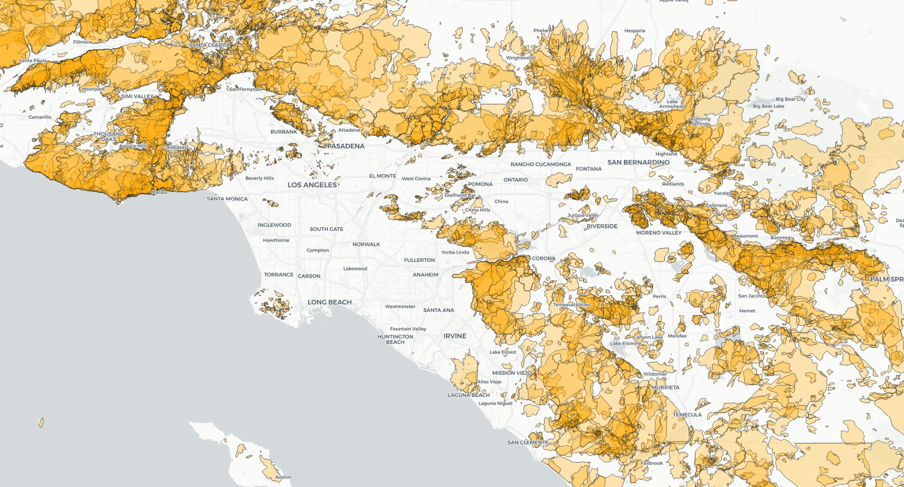
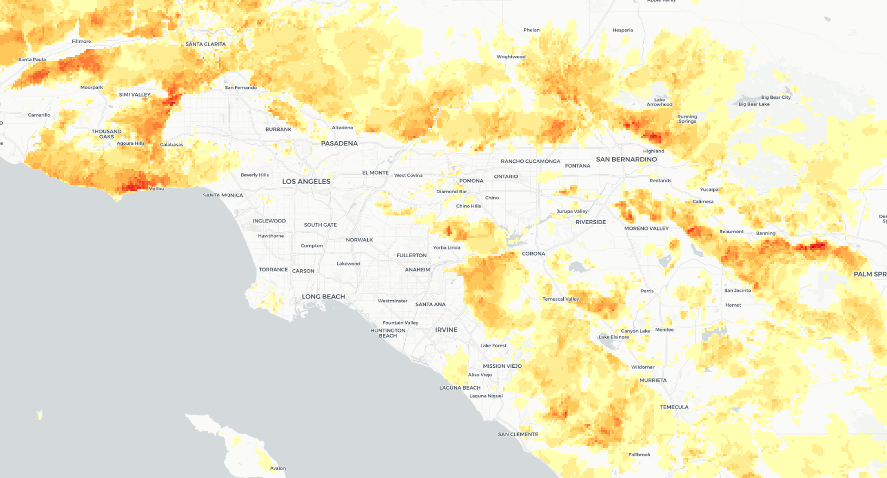

```{r setup, include = FALSE}
library(knitr)
opts_chunk$set(out.width="900px", dpi=300, message =FALSE, warning = FALSE)
```

<style>
  .responsive-google-slides {
    position: relative;
    padding-bottom: 56.25%; /* 16:9 Ratio */
    height: 0;
    overflow: hidden;
  }
  .responsive-google-slides iframe {
    border: 0;
    position: absolute;
    top: 0;
    left: 0;
    width: 100% !important;
    height: 100% !important;
  }
</style>

# Learning to love gridded climate data

The slides for this session introduce the concept of gridded climate
data and the [widely
used](https://www.unidata.ucar.edu/software/netcdf/usage.html) Network
Common Data Form or
[netCDF](https://www.unidata.ucar.edu/software/netcdf/) data format.
Gridded data means that a geographical area has been divided into a
regular grid, and then values have been assigned to each cell in that
grid. Often the data has a time-series element, with a separate grid
layer for each of multiple periods of time.

In the session I'll also attempt a live demo, working with NASA's
[**Panoply**](https://www.giss.nasa.gov/tools/panoply/) software to view a
netCDF file and to show how to make customized maps and animations from
data like this.

<div class = "responsive-google-slides">
<iframe src="https://docs.google.com/presentation/d/e/2PACX-1vTQW9gK4yAb5eEGolItEu3HAd9qtNo0t6W-Hw-h3duhcMR6-SWrRcq0SMrA6R5hbYRs5D_knHgKuzfl/embed?start=false&amp;loop=true&amp;delayms=60000" frameborder="0" allowfullscreen="true" mozallowfullscreen="true" webkitallowfullscreen="true">
</iframe>
</div>

## An introduction to the R raster package for working with gridded climate data

If you are willing to learn some simple code, the R [**raster**](https://rspatial.org/raster/pkg/index.html) package
is very powerful, allowing you to work with gridded data in flexible
ways. Below are some code examples to give you a flavor of the possibilities.

### Processing NASA's GISTEMP global temperature analysis

NASA's [GISTEMP](https://data.giss.nasa.gov/gistemp/) surface
temperature analysis contains monthly temperature records from 1880 onward for a
global grid with cells of 2 degrees latitude by 2 degrees longitude. The values in each cell are the difference between average temperature for that time period compared to the average for a reference period from 1951 to 1980.

The code below processes this data, available
for download from
[here](https://data.giss.nasa.gov/pub/gistemp/gistemp1200_GHCNv4_ERSSTv5.nc.gz)
as a netCDF file, to the data files used to make this interactive:

<iframe src="https://data.buzzfeed.com/projects/climate-files/temperature.html" width="100%" height="500" frameborder="0" marginheight="0" marginwidth="0">

</iframe>

An earlier version of this map first appeared in this [Apr. 22, 2019
BuzzFeed News
post](https://www.buzzfeednews.com/article/peteraldhous/climate-change-maps-ice-sea-level-rise).

#### Setting up

```{r}
# load required packages
library(raster)
library(rgdal)

# load data from netCDF file as raster brick object
temperature_monthly <- brick("data/gistemp1200_GHCNv4_ERSSTv5.nc")
```

In addition to **raster**, I loaded the
[**rdgal**](https://rgdal.r-forge.r-project.org/) package, which connects
to the [Geospatial Data Abstraction Library](https://gdal.org/). GDAL
allows you to read, write, and process geodata. You may already be
familiar with it if you have worked with
[QGIS](https://qgis.org/en/site/).

NetCDF files often contain multiple gridded data layers, one for each time interval -- in this case a layer for each month. Using the
[**brick**](http://finzi.psych.upenn.edu/library/raster/html/brick.html) function, such netCDF data files can be loaded as [RasterBrick](https://rspatial.org/raster/pkg/2-classes.html#rasterstack-and-rasterbrick) objects, which hold multiple data layers.

#### Making new layers for years, rather than months

The following code uses the
[**stackApply**](https://search.r-project.org/library/raster/html/stackApply.html)
function to run some calculations on the data to create one layer for
each year, rather than each month:

```{r}
# create vector to serve as index for calculating annual values
# we need an index with 12 repeats of an index number for each of the 141 years in the data
num_years <- rep(1:141, each = 12)

# calculate annual averages, giving 141 layers one for each year 1880-2020 in the data
temperature_annual <- stackApply(temperature_monthly, indices = num_years, fun = mean)
```

#### Convert to a spatial polygons data frame, then write to GeoJSON

```{r}
# convert to spatial polygons data frame
temperature_annual_df <- as(temperature_annual,"SpatialPolygonsDataFrame")
# name the variables in the data frame as years
names(temperature_annual_df@data) <- c(as.character(1880:2020))

# write to GeoJSON
writeOGR(temperature_annual_df, "data/temperature_annual.geojson",
layer = "temperature", driver = "GeoJSON")
```

#### Make the map overlay

The code below first subsets the annual data to isolate the most recent decade,
and then uses the
[**calc**](https://rspatial.org/raster/spatial/8-rastermanip.html?#calc)
function to calculate the average temperature differences for this decade
from the 1951-1980 reference period.

```{r}
temperature_diff <- subset(temperature_annual, 132:141)
temperature_diff <- calc(temperature_diff, mean, na.rm = TRUE) 
```

#### Interpolate the data to a higher resolution and write to a GeoTIFF

We saw that the Panoply software can apply an interpolation to smooth
the data so is doesn't display as an obvious grid. We can apply a
similar effect using the
[**resample**](http://search.r-project.org/library/raster/html/resample.html) function. Be cautious with such interpolations: I was comfortable doing
this to provide a less jarring appearance for the map overlay, but I would
not have done this for the data displayed on the charts.

```{r}
# create a raster object with the same extent but higher resolution 
r <- raster(nrow = 1800, ncol = 3600, extent(c(-180, 180, -90, 90))) 
# resample the data using this raster 
temperature_diff <- resample(temperature_diff, r, method = "bilinear")

# write to GeoTIFF
writeRaster(temperature_diff, filename="data/temperature_diff.tif", format = "GTiff", overwrite = TRUE)
```

I styled the GeoTIFF in QGIS and imported to
[Mapbox](https://www.mapbox.com/) as a raster [tileset](https://docs.mapbox.com/studio-manual/reference/tilesets/). The GeoJSON was
imported to Mapbox as a vector tileset.

The interactive map and chart was made with [Mapbox
GL](https://docs.mapbox.com/mapbox-gl-js/api/) and
[Highcharts](https://www.highcharts.com/). The vector tileset is queried
on a map click or location search to yield the data displayed in the chart.

### Making gridded data on burn frequency from CAL FIRE's historical fire footprints data.

For a student project at UC Berkeley J-School, we wanted to look at the distribution of rare plant species in relation to historical burn frequencies. The California Department of Forestry and Fire Protection, or CAL FIRE, maintains a geodatabase of [historical fire footprints](https://frap.fire.ca.gov/media/10969/fire19_1.zip), currently complete until 2019. The following code takes a shapefile processed from this geodatabase for a century of fires from 1920 to 2019 and uses the [**rasterize**](http://search.r-project.org/library/raster/html/rasterize.html) function to calculate the number of overlapping polygons at the center of each  cell for a grid of 0.005 degrees latitude by 0.005 degrees longitude drawn across the entire state. Using "count" to summarize any variable in the data simply counts the number of polygons; other summary functions are available.

```{r}
# load data from shapefile
fire_perimeters <- shapefile("data/fire_perimeters/fire_perimeters.shp")

# review variables in the data
dplyr::glimpse(fire_perimeters@data)

# raster template of grid 0.005 degrees lat and lon for bounding box around CA
r <- raster(ncol = 2400, nrow = 2000, extent(c(-126, -113, 32, 42)))

# create raster layer with number of overlapping fire footprints the center of each cell in that grid
burn_freq <- rasterize(fire_perimeters, r, field = "Shp_Lng", fun = "count")

# write to GeoTIFF 
writeRaster(burn_freq, "data/burn_frequency.geotiff", format = "GTiff", overwrite = TRUE)
```

#### Here is the original data displayed in QGIS showing 100 years of fire footprints around Los Angeles:



#### Here is the gridded data layer showing relative burn frequencies over the past 100 years:



<br>
<br>

